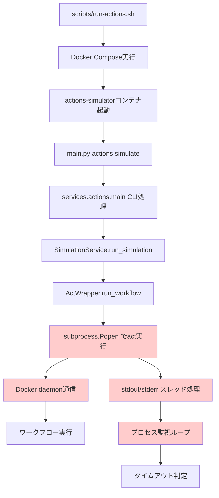

# Design Document

## Overview

GitHub Actionsシミュレーターのハングアップ問題は、複数の潜在的な原因が組み合わさって発生している可能性が高い。実行フローの分析により、以下の主要な問題領域が特定された：

1. **Docker Socket通信の問題**: コンテナ内からホストのDocker daemonへの通信が適切に行われていない
2. **プロセス管理とタイムアウト処理**: subprocess実行時のデッドロックやタイムアウト監視の不備
3. **出力ストリーミングの問題**: stdout/stderrの非同期処理でのスレッド同期問題
4. **環境変数とコンテナ設定**: 必要な環境変数や権限の不足

## Architecture

### 実行フロー分析



### 問題の特定箇所

1. **Docker Socket通信 (I)**: `/var/run/docker.sock`へのアクセス権限やネットワーク設定
2. **Subprocess実行 (H)**: `subprocess.Popen`での非同期実行とパイプ処理
3. **出力ストリーミング (K)**: `threading.Thread`での stdout/stderr 処理
4. **プロセス監視 (L)**: `process.poll()`とタイムアウト判定のループ

## Components and Interfaces

### 1. 診断・デバッグコンポーネント

#### DiagnosticService
```python
class DiagnosticService:
    def check_docker_connectivity(self) -> DiagnosticResult
    def check_act_binary(self) -> DiagnosticResult
    def check_container_permissions(self) -> DiagnosticResult
    def trace_execution_flow(self, workflow_file: Path) -> ExecutionTrace
```

#### ExecutionTracer
```python
class ExecutionTracer:
    def trace_subprocess_execution(self, cmd: List[str]) -> ProcessTrace
    def monitor_docker_communication(self) -> DockerTrace
    def track_thread_lifecycle(self) -> ThreadTrace
```

### 2. 改良されたプロセス管理

#### EnhancedActWrapper
```python
class EnhancedActWrapper(ActWrapper):
    def run_workflow_with_diagnostics(self, **kwargs) -> DetailedResult
    def _create_monitored_subprocess(self, cmd: List[str]) -> MonitoredProcess
    def _handle_output_streaming_safely(self, process: subprocess.Popen) -> StreamResult
```

#### ProcessMonitor
```python
class ProcessMonitor:
    def monitor_with_heartbeat(self, process: subprocess.Popen, timeout: int) -> MonitorResult
    def detect_deadlock_conditions(self) -> List[DeadlockIndicator]
    def force_cleanup_on_timeout(self, process: subprocess.Popen) -> None
```

### 3. Docker統合の改善

#### DockerIntegrationChecker
```python
class DockerIntegrationChecker:
    def verify_socket_access(self) -> bool
    def test_container_communication(self) -> bool
    def check_act_docker_compatibility(self) -> CompatibilityResult
```

## Data Models

### DiagnosticResult
```python
@dataclass
class DiagnosticResult:
    component: str
    status: DiagnosticStatus  # OK, WARNING, ERROR
    message: str
    details: Dict[str, Any]
    recommendations: List[str]
```

### ExecutionTrace
```python
@dataclass
class ExecutionTrace:
    start_time: datetime
    end_time: Optional[datetime]
    stages: List[ExecutionStage]
    hang_point: Optional[str]
    resource_usage: ResourceUsage
```

### ProcessTrace
```python
@dataclass
class ProcessTrace:
    command: List[str]
    pid: Optional[int]
    start_time: datetime
    stdout_bytes: int
    stderr_bytes: int
    thread_states: Dict[str, str]
    docker_operations: List[DockerOperation]
```

### DetailedResult
```python
@dataclass
class DetailedResult(SimulationResult):
    execution_trace: ExecutionTrace
    diagnostic_results: List[DiagnosticResult]
    performance_metrics: PerformanceMetrics
    hang_analysis: Optional[HangAnalysis]
```

## Error Handling

### 1. 段階的エラー検出

```python
class HangupDetector:
    def detect_docker_socket_issues(self) -> List[DockerIssue]
    def detect_subprocess_deadlock(self) -> List[DeadlockIssue]
    def detect_timeout_problems(self) -> List[TimeoutIssue]
    def detect_permission_issues(self) -> List[PermissionIssue]
```

### 2. 自動復旧メカニズム

```python
class AutoRecovery:
    def attempt_docker_reconnection(self) -> bool
    def restart_hung_subprocess(self, process: subprocess.Popen) -> bool
    def clear_output_buffers(self) -> None
    def reset_container_state(self) -> bool
```

### 3. 詳細エラーレポート

```python
class ErrorReporter:
    def generate_hangup_report(self, trace: ExecutionTrace) -> HangupReport
    def suggest_fixes(self, issues: List[Issue]) -> List[Fix]
    def create_debug_bundle(self) -> DebugBundle
```

## Testing Strategy

### 1. 単体テスト

- **DiagnosticService**: Docker接続、act binary、権限チェックのテスト
- **ProcessMonitor**: タイムアウト処理、プロセス監視のテスト
- **ExecutionTracer**: トレース機能、ログ出力のテスト

### 2. 統合テスト

- **Docker環境テスト**: 実際のDocker環境でのact実行テスト
- **タイムアウトシナリオ**: 意図的なタイムアウト発生とハンドリングテスト
- **並行実行テスト**: 複数ワークフローの同時実行テスト

### 3. エンドツーエンドテスト

- **実ワークフローテスト**: 様々な.github/workflows/*.ymlファイルでのテスト
- **長時間実行テスト**: 長時間実行されるワークフローでのハングアップテスト
- **リソース制限テスト**: メモリ・CPU制限下でのテスト

### 4. デバッグ支援テスト

- **診断機能テスト**: 各種診断機能の正確性テスト
- **トレース機能テスト**: 実行トレースの完全性テスト
- **エラーレポートテスト**: エラーレポートの有用性テスト

## Implementation Phases

### Phase 1: 診断・調査機能の実装
- DiagnosticServiceの実装
- ExecutionTracerの基本機能実装
- 既存コードへの診断ポイント追加

### Phase 2: プロセス管理の改善
- EnhancedActWrapperの実装
- ProcessMonitorの実装
- タイムアウト処理の改善

### Phase 3: Docker統合の最適化
- DockerIntegrationCheckerの実装
- コンテナ設定の見直し
- 権限・ネットワーク設定の最適化

### Phase 4: エラーハンドリングと復旧
- HangupDetectorの実装
- AutoRecoveryメカニズムの実装
- 詳細エラーレポート機能の実装

### Phase 5: テストと検証
- 包括的テストスイートの実装
- パフォーマンステストの実行
- 本番環境での検証
