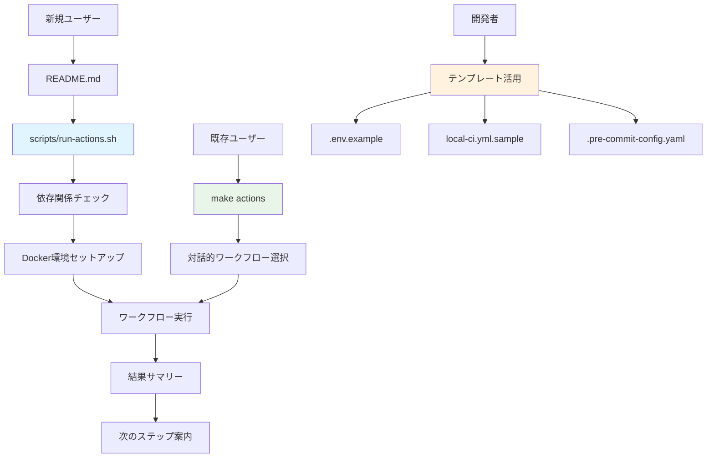
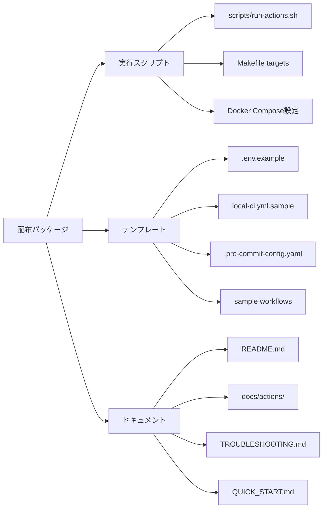

# 設計書

## 概要

GitHub Actions SimulatorのフェーズC「配布・体験強化」では、軽量で使いやすいツールとして完成させるため、以下の3つの主要領域に焦点を当てる：

1. **配布スクリプトの本格化**: `scripts/run-actions.sh`を本格的な配布形式に整備
2. **ドキュメント刷新**: 軽量actベースアーキテクチャを反映した包括的ドキュメント更新
3. **テンプレート・設定例の提供**: 利用者がすぐに使えるサンプルファイル群の整備

これにより、開発者が最小限の設定でGitHub Actionsワークフローをローカルで事前チェックできる完成された体験を提供する。

## アーキテクチャ

### 配布・体験強化の全体構成



### 配布パッケージ構成



## コンポーネントと インターフェース

### 1. 配布スクリプト強化

#### EnhancedDistributionScript
```bash
# scripts/run-actions.sh の強化版
class DistributionScript {
    check_dependencies()     # Docker, uv, git の確認
    install_guidance()       # プラットフォーム別インストール手順
    environment_setup()      # 自動環境セットアップ
    workflow_execution()     # ワークフロー実行
    result_summary()         # 結果要約と次のステップ
    error_handling()         # エラー時のトラブルシューティング
}
```

#### DependencyChecker
```bash
check_docker() {
    # Docker & Docker Compose の確認
    # バージョン互換性チェック
    # 権限確認（rootless Docker対応）
}

check_uv() {
    # uv の存在確認
    # バージョン確認
    # フォールバック戦略（pip使用）
}

check_git() {
    # Git の存在確認
    # リポジトリ状態確認
}
```

### 2. ドキュメント刷新システム

#### DocumentationManager
```python
class DocumentationManager:
    def update_main_readme(self) -> None
        # メインREADMEの軽量アーキテクチャ反映

    def refresh_actions_docs(self) -> None
        # docs/actions/ 配下の全面刷新

    def create_quick_start_guide(self) -> None
        # 新規ユーザー向けクイックスタート

    def update_troubleshooting(self) -> None
        # トラブルシューティングガイド更新

    def validate_consistency(self) -> List[InconsistencyIssue]
        # ドキュメント間の整合性チェック
```

#### DocumentationStructure
```text
docs/
├── QUICK_START.md          # 新規作成：5分で始められるガイド
├── TROUBLESHOOTING.md      # 更新：軽量アーキテクチャ対応
├── actions/
│   ├── README.md           # 更新：現状反映
│   ├── USER_GUIDE.md       # 新規：詳細利用ガイド
│   ├── TEMPLATES.md        # 新規：テンプレート説明
│   └── FAQ.md              # 新規：よくある質問
└── CONTRIBUTING.md         # 更新：開発者向け情報
```

### 3. テンプレート・設定システム

#### TemplateManager
```python
class TemplateManager:
    def create_env_example(self) -> None
        # .env.example の充実化

    def create_workflow_samples(self) -> None
        # サンプルワークフローファイル作成

    def create_precommit_config(self) -> None
        # .pre-commit-config.yaml テンプレート

    def validate_templates(self) -> List[ValidationError]
        # テンプレートの動作確認
```

#### TemplateFiles
```text
templates/
├── .env.example                    # 充実した環境変数例
├── .github/workflows/
│   ├── local-ci.yml.sample        # ローカルCI用サンプル
│   ├── basic-test.yml.sample      # 基本テスト用
│   └── security-scan.yml.sample   # セキュリティスキャン用
├── .pre-commit-config.yaml.sample # pre-commit設定例
└── docker-compose.override.yml.sample # Docker設定カスタマイズ例
```

## データモデル

### DistributionConfig
```python
@dataclass
class DistributionConfig:
    required_docker_version: str = "20.10.0"
    required_compose_version: str = "2.0.0"
    supported_platforms: List[str] = field(default_factory=lambda: ["linux", "darwin", "windows"])
    fallback_strategies: Dict[str, str] = field(default_factory=dict)
    installation_guides: Dict[str, str] = field(default_factory=dict)
```

### DocumentationMetadata
```python
@dataclass
class DocumentationMetadata:
    file_path: Path
    last_updated: datetime
    version: str
    dependencies: List[str]  # 他のドキュメントへの依存
    validation_status: ValidationStatus
```

### TemplateDefinition
```python
@dataclass
class TemplateDefinition:
    name: str
    source_path: Path
    target_path: Path
    variables: Dict[str, Any]
    validation_rules: List[ValidationRule]
    usage_instructions: str
```

## エラーハンドリング

### 1. 配布スクリプトエラー処理

```bash
handle_dependency_missing() {
    local missing_dep="$1"
    case "$missing_dep" in
        "docker")
            show_docker_installation_guide
            ;;
        "uv")
            show_uv_installation_guide
            offer_pip_fallback
            ;;
        "git")
            show_git_installation_guide
            ;;
    esac
}

show_platform_specific_guide() {
    local platform=$(detect_platform)
    case "$platform" in
        "ubuntu"|"debian")
            show_apt_installation
            ;;
        "macos")
            show_brew_installation
            ;;
        "windows")
            show_wsl_setup_guide
            ;;
    esac
}
```

### 2. ドキュメント整合性エラー

```python
class DocumentationValidator:
    def check_link_validity(self) -> List[BrokenLink]:
        # 内部リンクの有効性確認

    def check_version_consistency(self) -> List[VersionMismatch]:
        # バージョン情報の整合性確認

    def check_code_example_validity(self) -> List[InvalidExample]:
        # コード例の動作確認
```

### 3. テンプレート検証エラー

```python
class TemplateValidator:
    def validate_syntax(self, template: TemplateDefinition) -> ValidationResult:
        # YAML/TOML/Shell構文チェック

    def validate_functionality(self, template: TemplateDefinition) -> ValidationResult:
        # 実際の動作確認

    def validate_security(self, template: TemplateDefinition) -> SecurityResult:
        # セキュリティ設定の確認
```

## テスト戦略

### 1. 配布スクリプトテスト

```bash
# tests/test_distribution.bats
@test "dependency check works on clean system" {
    # 依存関係チェック機能のテスト
}

@test "installation guidance is platform-specific" {
    # プラットフォーム別ガイダンスのテスト
}

@test "error handling provides actionable messages" {
    # エラーメッセージの有用性テスト
}
```

### 2. ドキュメント整合性テスト

```python
# tests/test_documentation.py
class TestDocumentationConsistency:
    def test_all_links_are_valid(self):
        # 全リンクの有効性確認

    def test_version_numbers_match(self):
        # バージョン番号の整合性確認

    def test_code_examples_work(self):
        # コード例の動作確認
```

### 3. テンプレート機能テスト

```python
# tests/test_templates.py
class TestTemplates:
    def test_env_example_completeness(self):
        # .env.example の完全性確認

    def test_workflow_samples_validity(self):
        # ワークフローサンプルの有効性確認

    def test_precommit_config_works(self):
        # pre-commit設定の動作確認
```

### 4. エンドツーエンドテスト

```bash
# tests/test_end_to_end_distribution.bats
@test "complete distribution flow works" {
    # 配布から実行までの完全フロー
}

@test "new user experience is smooth" {
    # 新規ユーザー体験のテスト
}
```

## 実装フェーズ

### Phase C1: 配布スクリプト本格化

1. **依存関係チェック強化**
   - プラットフォーム検出機能
   - バージョン互換性チェック
   - インストールガイダンス

2. **エラーハンドリング改善**
   - 詳細エラーメッセージ
   - 復旧手順の提示
   - ログ収集機能

3. **ユーザー体験向上**
   - 進捗表示
   - 結果サマリー
   - 次のステップ案内

### Phase C2: ドキュメント刷新

1. **メインドキュメント更新**
   - README.md の軽量アーキテクチャ反映
   - クイックスタートガイド作成
   - トラブルシューティング更新

2. **actionsディレクトリ刷新**
   - 現状に合わせた内容更新
   - 詳細利用ガイド作成
   - FAQ作成

3. **整合性確保**
   - ドキュメント間リンク確認
   - バージョン情報統一
   - 古い情報の削除

### Phase C3: テンプレート・設定整備

1. **環境設定テンプレート**
   - .env.example 充実化
   - Docker設定カスタマイズ例
   - 開発環境セットアップガイド

2. **ワークフローテンプレート**
   - local-ci.yml.sample 作成
   - 基本的なCI/CDパターン例
   - セキュリティスキャン例

3. **開発者向け設定**
   - .pre-commit-config.yaml 改善
   - 開発ワークフロー統合
   - 品質ゲート設定例

## パフォーマンス考慮事項

### 配布スクリプト最適化

- **並列処理**: 依存関係チェックの並列実行
- **キャッシュ活用**: Dockerイメージキャッシュの効率的利用
- **タイムアウト設定**: 各処理の適切なタイムアウト設定

### ドキュメント生成最適化

- **増分更新**: 変更されたファイルのみ更新
- **リンク検証キャッシュ**: 外部リンクチェック結果のキャッシュ
- **並列検証**: 複数ドキュメントの並列検証

## セキュリティ考慮事項

### 配布スクリプトセキュリティ

- **入力検証**: ユーザー入力の適切な検証
- **権限最小化**: 必要最小限の権限での実行
- **秘密情報保護**: 環境変数やトークンの適切な取り扱い

### テンプレートセキュリティ

- **デフォルト設定**: セキュアなデフォルト設定
- **権限設定**: 適切なファイル権限
- **秘密情報除外**: サンプルファイルからの秘密情報除外

## 運用・保守性

### 自動化

- **CI/CD統合**: ドキュメント更新の自動化
- **テンプレート検証**: 定期的なテンプレート動作確認
- **リンク監視**: 外部リンクの定期監視

### 保守性

- **モジュール化**: 各コンポーネントの独立性確保
- **設定外部化**: ハードコードされた値の設定ファイル化
- **ログ機能**: 適切なログ出力とデバッグ支援
