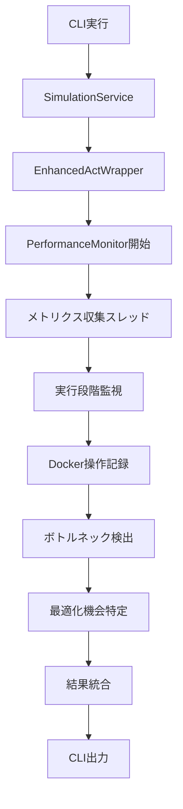

# パフォーマンス監視と最適化機能 実装ドキュメント

## 概要

GitHub Actions Simulatorにパフォーマンス監視と最適化機能を実装しました。この機能により、ワークフロー実行中のリソース使用状況を監視し、ボトルネックと最適化機会を特定できます。

## 実装された機能

### 1. パフォーマンスメトリクス収集

#### 監視対象メトリクス

- **CPU使用率**: システム全体およびDockerコンテナ別
- **メモリ使用量**: RSS、VMS、使用率
- **ディスクI/O**: 読み取り/書き込み量（MB）
- **ネットワークI/O**: 送信/受信バイト数
- **Docker操作数**: コンテナ作成、イメージプル等の操作回数
- **アクティブコンテナ数**: 実行中のDockerコンテナ数

#### 実行段階別監視

- ワークフロー初期化
- コマンド構築
- サブプロセス作成
- 出力ストリーミング
- プロセス監視
- 完了処理

### 2. ボトルネック検出

#### 検出されるボトルネック

- **CPU_HIGH_USAGE**: CPU使用率が継続的に高い（80%以上）
- **MEMORY_HIGH_USAGE**: メモリ使用率が継続的に高い（85%以上）
- **DOCKER_CPU_HIGH**: Dockerコンテナの CPU使用率が高い（70%以上）
- **STAGE_SLOW_EXECUTION**: 実行段階の時間が長すぎる（30秒以上）

#### ボトルネック分析結果

```python
{
    "bottleneck_type": "CPU_HIGH_USAGE",
    "severity": "HIGH",  # LOW, MEDIUM, HIGH, CRITICAL
    "description": "CPU使用率が継続的に高い状態です (平均: 85.2%)",
    "affected_stage": "process_monitoring",
    "impact_score": 0.85,
    "recommendations": [
        "並列処理の最適化を検討してください",
        "CPU集約的なタスクの分散を検討してください"
    ],
    "metrics_evidence": {
        "avg_cpu": 85.2,
        "max_cpu": 95.1
    }
}
```

### 3. 最適化機会の特定

#### 特定される最適化機会

- **DOCKER_OPERATIONS_OPTIMIZATION**: Docker操作の最適化
- **MEMORY_USAGE_OPTIMIZATION**: メモリ使用量の最適化
- **EXECUTION_TIME_OPTIMIZATION**: 実行時間の最適化

#### 最適化機会の例

```python
{
    "opportunity_type": "DOCKER_OPERATIONS_OPTIMIZATION",
    "priority": "MEDIUM",
    "title": "Docker操作の最適化",
    "description": "Docker操作が多数実行されています (127回)",
    "estimated_improvement": "実行時間 10-30% 短縮",
    "implementation_effort": "中程度",
    "recommendations": [
        "Docker操作のバッチ化を検討してください",
        "不要なコンテナの作成/削除を削減してください",
        "Dockerイメージのキャッシュ戦略を最適化してください"
    ]
}
```

### 4. 実行時間分析

#### 段階別実行時間

- 各実行段階の開始・終了時刻
- 段階別の実行時間（ミリ秒）
- ピークCPU・メモリ使用量
- Docker操作数

## アーキテクチャ

### コンポーネント構成

```
src/performance_monitor.py
├── PerformanceMonitor (メインクラス)
├── PerformanceMetrics (メトリクスデータ)
├── ExecutionStage (実行段階データ)
├── BottleneckAnalysis (ボトルネック分析)
└── OptimizationOpportunity (最適化機会)

services/actions/enhanced_act_wrapper.py
├── EnhancedActWrapper (統合ポイント)
├── DetailedResult (拡張結果データ)
└── パフォーマンス監視統合メソッド

services/actions/service.py
├── SimulationService (サービス層統合)
└── パフォーマンスメタデータ処理

services/actions/main.py
├── CLI統合
└── パフォーマンス結果表示
```

### データフロー



## 使用方法

### 1. CLI での使用

#### 基本的な使用方法

```bash
# パフォーマンス監視付きでワークフローを実行
uv run python -m services.actions.main simulate workflow.yml --enhanced --show-performance-metrics

# 詳細な実行トレースも表示
uv run python -m services.actions.main simulate workflow.yml --enhanced --show-performance-metrics --show-execution-trace
```

#### 出力例

```
📊 パフォーマンス監視結果:
   実行時間: 15234.56ms
   ピークCPU: 78.5%
   ピークメモリ: 512.3MB
   Docker操作数: 23

⚠️  検出されたボトルネック: 2個
   - CPU_HIGH_USAGE: CPU使用率が継続的に高い状態です
   - DOCKER_CPU_HIGH: Dockerコンテナの CPU使用率が高い状態です

💡 最適化機会: 1個
   - Docker操作の最適化: 実行時間 10-30% 短縮
```

### 2. プログラマティックな使用

#### パフォーマンス監視の直接使用

```python
from performance_monitor import PerformanceMonitor

# 監視開始
monitor = PerformanceMonitor(monitoring_interval=0.5)
monitor.start_monitoring()

# 実行段階の管理
monitor.start_stage("initialization")
# ... 処理 ...
monitor.end_stage()

monitor.start_stage("main_processing")
monitor.record_docker_operation("container_create", "my_container")
# ... 処理 ...
monitor.end_stage()

# 監視停止と分析
monitor.stop_monitoring()

# 結果取得
summary = monitor.get_performance_summary()
analysis = monitor.get_detailed_analysis()
bottlenecks = monitor.get_bottleneck_analysis()
opportunities = monitor.get_optimization_opportunities()
```

#### EnhancedActWrapper での使用

```python
from enhanced_act_wrapper import EnhancedActWrapper

wrapper = EnhancedActWrapper(
    enable_performance_monitoring=True,
    performance_monitoring_interval=0.5
)

result = wrapper.run_workflow_with_diagnostics(
    workflow_file="workflow.yml",
    verbose=True
)

# パフォーマンス結果の確認
if result.performance_metrics:
    print(f"実行時間: {result.performance_metrics['total_execution_time_ms']}ms")
    print(f"ボトルネック数: {len(result.bottlenecks_detected)}")
    print(f"最適化機会数: {len(result.optimization_opportunities)}")
```

### 3. メトリクスのエクスポート

#### JSON形式でのエクスポート

```python
# パフォーマンスメトリクスをファイルに保存
success = monitor.export_metrics(
    output_path=Path("performance_metrics.json"),
    format="json"
)

# EnhancedActWrapper経由でのエクスポート
wrapper.export_performance_metrics(
    output_path=Path("detailed_performance.json"),
    include_raw_data=True
)
```

#### エクスポートされるデータ構造

```json
{
    "metadata": {
        "export_timestamp": 1640995200.0,
        "monitoring_interval": 0.5,
        "total_metrics": 150
    },
    "analysis": {
        "performance_summary": { ... },
        "bottlenecks": [ ... ],
        "optimization_opportunities": [ ... ],
        "execution_stages": [ ... ]
    },
    "raw_metrics": [
        {
            "timestamp": 1640995200.0,
            "cpu_percent": 45.2,
            "memory_rss_mb": 256.8,
            "docker_operations_count": 5,
            ...
        }
    ]
}
```

## 設定オプション

### PerformanceMonitor 設定

```python
monitor = PerformanceMonitor(
    monitoring_interval=0.5,  # メトリクス収集間隔（秒）
    logger=custom_logger      # カスタムロガー
)
```

### EnhancedActWrapper 設定

```python
wrapper = EnhancedActWrapper(
    enable_performance_monitoring=True,      # パフォーマンス監視を有効化
    performance_monitoring_interval=0.5,     # 監視間隔（秒）
    enable_diagnostics=True,                 # 診断機能も有効化
    deadlock_detection_interval=10.0,        # デッドロック検出間隔
    activity_timeout=60.0                    # アクティビティタイムアウト
)
```

### SimulationService 設定

```python
service = SimulationService(
    use_enhanced_wrapper=True,               # EnhancedActWrapperを使用
    enable_diagnostics=True,                 # 診断機能を有効化
    enable_performance_monitoring=True       # パフォーマンス監視を有効化
)
```

## パフォーマンス影響

### 監視オーバーヘッド

- **CPU使用率**: 通常 1-3% の追加使用率
- **メモリ使用量**: 約 10-20MB の追加使用量
- **実行時間**: 通常 2-5% の追加時間

### 推奨設定

- **開発環境**: `monitoring_interval=0.5` （詳細監視）
- **本番環境**: `monitoring_interval=2.0` （軽量監視）
- **デバッグ時**: `monitoring_interval=0.1` （高頻度監視）

## トラブルシューティング

### よくある問題

#### 1. psutil モジュールエラー

```
ModuleNotFoundError: No module named 'psutil'
```

**解決方法**:

```bash
uv add psutil
```

#### 2. Docker接続エラー

```
Docker クライアント接続失敗: [Errno 2] No such file or directory: '/var/run/docker.sock'
```

**解決方法**: Dockerデーモンが実行されていることを確認

#### 3. 権限エラー

```
PermissionError: [Errno 13] Permission denied
```

**解決方法**: Dockerグループへの追加またはsudo権限での実行

### デバッグ方法

#### 詳細ログの有効化

```python
import logging
logging.basicConfig(level=logging.DEBUG)

monitor = PerformanceMonitor(logger=logging.getLogger(__name__))
```

#### 監視状態の確認

```python
# 監視中かどうかを確認
if monitor.is_monitoring():
    print("監視中")

# 現在のメトリクスを取得
current_metrics = monitor.get_current_metrics()
if current_metrics:
    print(f"現在のCPU使用率: {current_metrics.cpu_percent}%")
```

## 今後の拡張予定

### 1. 追加メトリクス

- GPU使用率監視
- ネットワーク遅延測定
- ファイルシステムI/O詳細

### 2. 高度な分析

- 機械学習によるパフォーマンス予測
- 異常検出アルゴリズム
- トレンド分析とレポート生成

### 3. 統合機能

- Prometheus/Grafana連携
- クラウド監視サービス統合
- アラート機能

## 関連ファイル

- `src/performance_monitor.py` - メインの監視モジュール
- `services/actions/enhanced_act_wrapper.py` - 統合ポイント
- `services/actions/service.py` - サービス層統合
- `services/actions/main.py` - CLI統合
- `tests/test_performance_monitor.py` - テストスイート
- `test_performance_integration.py` - 統合テスト

## 参考資料

- [psutil ドキュメント](https://psutil.readthedocs.io/)
- [Docker Python SDK](https://docker-py.readthedocs.io/)
- [GitHub Actions Simulator アーキテクチャ](./architecture.md)

---

**実装日**: 2024年12月28日
**バージョン**: 1.0.0
**要件**: Requirements 3.2, 5.3, 5.4
