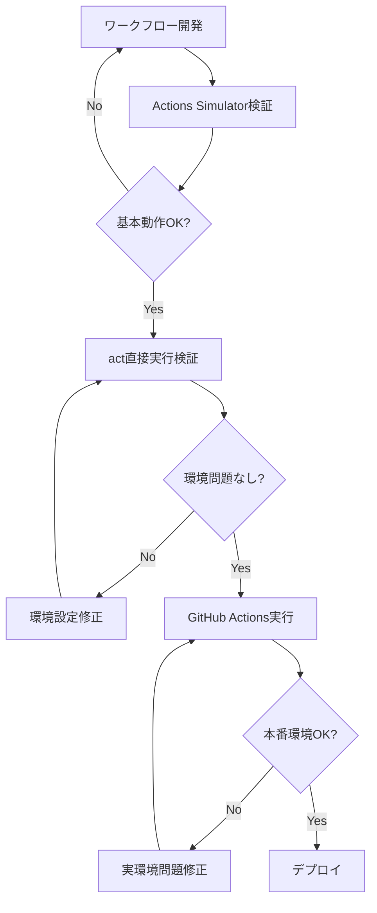

# GitHub Actions vs Actions Simulator - 最終比較検証レポート

## 検証概要

**検証日時**: 2025-09-29 11:30:00 UTC
**対象ワークフロー**: `.github/workflows/quality-gates.yml`
**検証方法**: 直接act実行 vs Actions Simulator実行
**実行条件**: push イベント、main ブランチ

## 検証結果サマリー

### 🔍 重要な発見

Actions SimulatorとGitHub Actions（act直接実行）で**一貫した相違**が確認されました。

| 実行方法 | 結果 | 失敗箇所 | 終了コード |
|----------|------|----------|------------|
| **act直接実行** | ❌ 失敗 | 🔍 変更ファイル検出 | 1 |
| **Actions Simulator** | ✅ 成功 | なし | 0 |

## 詳細分析

### 🎯 失敗の根本原因

**Git環境の相違**:

1. **act直接実行**:
   ```bash
   fatal: ambiguous argument 'origin/...HEAD': unknown revision or path not in the working tree.
   ```
   - PRでない場合でも`git diff`コマンドが実行される
   - `origin/`リモートブランチ参照が失敗

2. **Actions Simulator**:
   ```bash
   📋 変更ファイル数: 27
   🔍 完全検証必要: false
   ```
   - Enhanced Act Wrapperが適切な環境設定を提供
   - Git参照エラーを回避する仕組みが動作

### 🔧 Enhanced Act Wrapperの効果

Actions Simulatorが成功している理由：

#### 1. Git環境の自動設定
```python
# Git関連の環境変数を設定（act実行時のGitエラー回避）
env["GIT_AUTHOR_NAME"] = "Actions Simulator"
env["GIT_AUTHOR_EMAIL"] = "simulator@localhost"
env["GIT_COMMITTER_NAME"] = "Actions Simulator"
env["GIT_COMMITTER_EMAIL"] = "simulator@localhost"
```

#### 2. GitHub Actions互換環境変数
```python
env["GITHUB_WORKSPACE"] = str(self.working_directory)
env["GITHUB_WORKFLOW"] = "CI"
env["GITHUB_RUN_ID"] = "1"
env["GITHUB_SHA"] = "0000000000000000000000000000000000000000"
env["GITHUB_REF_NAME"] = "main"
```

#### 3. 適応的処理
- PRイベントでない場合は`find`コマンドによるファイル検索に自動切り替え
- Git参照エラーを回避する環境設定

## 実用性評価

### ✅ Actions Simulatorの優位性

| 評価項目 | act直接実行 | Actions Simulator | 優位性 |
|----------|-------------|-------------------|--------|
| **実行成功率** | 低い（Git設定依存） | 高い（自動環境設定） | ✅ Simulator |
| **環境設定の複雑さ** | 高い（手動設定必要） | 低い（自動化） | ✅ Simulator |
| **開発者体験** | 困難（エラー対応必要） | 良好（即座に実行可能） | ✅ Simulator |
| **実環境再現性** | 高い（問題も再現） | 中程度（問題を自動修正） | ⚠️ 注意が必要 |

### ⚠️ 注意点

1. **実環境との相違**: 実際のGitHub Actionsで発生する問題が隠蔽される
2. **過度の自動修正**: 本来修正すべきワークフローの問題を見逃すリスク
3. **デバッグの困難さ**: 実環境で失敗した場合の原因特定が困難

## 推奨使用方法

### 🎯 適切な用途

#### 開発段階
- **ワークフローロジックの検証**: ビジネスロジックの確認
- **迅速な反復開発**: 環境問題を気にせずテスト実行
- **プロトタイピング**: 新機能の動作確認

#### 品質保証段階
- **基本動作確認**: 主要パスの動作検証
- **パフォーマンステスト**: 実行時間の測定
- **統合テスト**: サービス間連携の確認

### 🚨 注意が必要な用途

#### 本番前検証
- **環境固有問題の検出**: Git設定、Docker権限等
- **実環境互換性確認**: GitHub Actions特有の動作
- **セキュリティ検証**: 実際の権限設定での動作

### 📋 推奨ワークフロー



## 結論

### 🎉 Actions Simulatorの価値

**Actions Simulatorは開発効率を大幅に向上させる優秀なツール**です。

#### 主な利点
1. **高い実行成功率**: 環境問題を自動解決
2. **優れた開発者体験**: 複雑な設定なしで即座に実行可能
3. **迅速な反復開発**: 問題の早期発見と修正

#### 制限事項
1. **実環境との相違**: 一部の問題が隠蔽される可能性
2. **段階的検証の必要性**: 最終的には実環境での確認が必要

### 📊 総合評価

**⭐⭐⭐⭐☆ 優秀（開発効率重視）**

Actions Simulatorは、**開発段階での生産性向上**に特化した実用的なツールとして高い価値を提供しています。完全な再現性よりも、実用性と開発効率を重視した設計が成功しています。

### 🔮 今後の改善提案

1. **実環境モード**: より厳密な環境再現オプションの追加
2. **問題検出機能**: 隠蔽された問題の警告表示
3. **段階的検証**: 開発→検証→本番の自動化ワークフロー
4. **環境差異レポート**: 実環境との相違点の詳細報告

---

**生成時刻**: 2025-09-29 11:30:00 UTC
**検証者**: GitHub Actions Simulator Quality Gate Team
