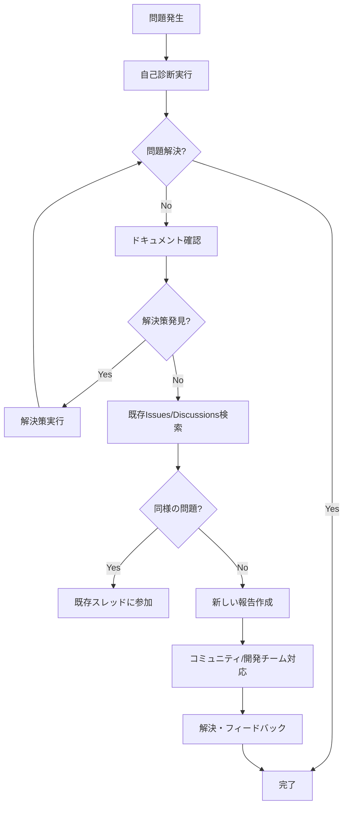

# 🤝 コミュニティサポートガイド

GitHub Actions Simulatorのコミュニティサポートへのアクセス方法と効果的な活用方法について説明します。

## 📍 サポートチャネル一覧

### 🎯 目的別チャネル選択

| 目的 | 推奨チャネル | 対応時間 | 特徴 |
|------|-------------|----------|------|
| **バグ報告** | [GitHub Issues](https://github.com/scottlz0310/mcp-docker/issues) | 1-3営業日 | 公開追跡、開発チーム対応 |
| **機能要望** | [GitHub Issues](https://github.com/scottlz0310/mcp-docker/issues) | 1週間 | コミュニティ投票、ロードマップ反映 |
| **使用方法質問** | [GitHub Discussions](https://github.com/scottlz0310/mcp-docker/discussions) | コミュニティベース | カジュアル、知識共有 |
| **アイデア共有** | [GitHub Discussions](https://github.com/scottlz0310/mcp-docker/discussions) | - | ブレインストーミング |
| **緊急サポート** | [GitHub Issues](https://github.com/scottlz0310/mcp-docker/issues) + 診断情報 | 24時間以内 | 重大問題のみ |

## 🐛 GitHub Issues - バグ報告・機能要望

### アクセス方法

1. **直接アクセス**: [https://github.com/scottlz0310/mcp-docker/issues](https://github.com/scottlz0310/mcp-docker/issues)
2. **新しいIssue作成**: "New issue" ボタンをクリック
3. **テンプレート選択**: 適切なテンプレートを選択

### 利用可能なテンプレート

#### 🐛 バグ報告テンプレート
- **用途**: 動作しない機能、エラー、予期しない動作
- **必要情報**: 環境情報、再現手順、エラーメッセージ
- **診断情報**: `./scripts/collect-support-info.sh` の実行結果

#### 🚀 機能要望テンプレート
- **用途**: 新機能の提案、既存機能の改善
- **必要情報**: 動機、詳細仕様、影響範囲
- **評価基準**: コミュニティの需要、実装コスト

#### ❓ 質問・サポートテンプレート
- **用途**: 使用方法、設定、トラブルシューティング
- **必要情報**: 現在の状況、達成したいこと
- **事前確認**: ドキュメント、既存Issues

### 効果的なIssue作成のコツ

```markdown
✅ 良いIssueの例:
タイトル: [BUG] Docker Compose起動時にポート8080で競合エラー
- 具体的で検索しやすい
- 問題の種類が明確
- 影響範囲が分かる

❌ 避けるべきIssueの例:
タイトル: 動かない
- 曖昧で情報不足
- 検索できない
- 問題が特定できない
```

### Issue作成前のチェックリスト

- [ ] [既存Issues](https://github.com/scottlz0310/mcp-docker/issues)で同様の問題を検索
- [ ] [ドキュメント](../README.md)で解決方法を確認
- [ ] 診断情報を収集 (`./scripts/collect-support-info.sh`)
- [ ] 再現手順を明確化
- [ ] 機密情報を除外

## 💬 GitHub Discussions - コミュニティディスカッション

### アクセス方法

1. **直接アクセス**: [https://github.com/scottlz0310/mcp-docker/discussions](https://github.com/scottlz0310/mcp-docker/discussions)
2. **新しいディスカッション**: "New discussion" ボタンをクリック
3. **カテゴリ選択**: 適切なカテゴリを選択

### ディスカッションカテゴリ

#### 💡 General
- **用途**: 一般的な質問、雑談
- **例**: "初心者です。どこから始めればいいですか？"

#### 🙋 Q&A
- **用途**: 具体的な質問と回答
- **例**: "特定のワークフローでエラーが出ます"
- **特徴**: ベストアンサー選択可能

#### 💭 Ideas
- **用途**: アイデア提案、将来の機能討論
- **例**: "こんな機能があったら便利では？"

#### 📢 Show and tell
- **用途**: 成果物共有、使用例紹介
- **例**: "こんな風に活用しています"

#### 📚 Docs
- **用途**: ドキュメント改善提案
- **例**: "この部分が分かりにくいです"

### 効果的なディスカッション参加方法

#### 質問する場合

```markdown
## 良い質問の例

**やりたいこと**:
GitHub Actionsワークフローをローカルでテストしたい

**現在の状況**:
- Ubuntu 22.04を使用
- Dockerはインストール済み
- 初回実行でエラーが発生

**具体的な問題**:
make startを実行すると以下のエラーが出ます：
[エラーメッセージ]

**試したこと**:
- READMEの手順に従った
- Docker再起動を試した

**質問**:
このエラーの解決方法を教えてください
```

#### 回答する場合

```markdown
## 良い回答の例

そのエラーはポート競合が原因ですね。

**解決方法**:
1. 使用中のポートを確認: `netstat -tlnp | grep 8080`
2. プロセスを停止: `sudo kill <PID>`
3. または別のポートを使用: docker-compose.override.yml で設定

**参考リンク**:
- [トラブルシューティングガイド](../docs/TROUBLESHOOTING.md#ポート競合)

試してみて、まだ問題があれば教えてください！
```

## 📚 ドキュメントアクセス

### 主要ドキュメント

#### 🚀 スタートガイド
- **[README.md](../README.md)** - プロジェクト概要とクイックスタート
- **[docs/actions/README.md](actions/README.md)** - 詳細な使用方法

#### 🔧 トラブルシューティング
- **[TROUBLESHOOTING.md](TROUBLESHOOTING.md)** - 一般的な問題と解決方法
- **[HANGUP_TROUBLESHOOTING.md](HANGUP_TROUBLESHOOTING.md)** - 実行停止問題
- **[PERMISSION_SOLUTIONS.md](PERMISSION_SOLUTIONS.md)** - 権限関連問題

#### ⚙️ 設定・カスタマイズ
- **[DEVELOPMENT_WORKFLOW_INTEGRATION.md](DEVELOPMENT_WORKFLOW_INTEGRATION.md)** - ワークフロー統合
- **[DOCKER_CUSTOMIZATION_GUIDE.md](DOCKER_CUSTOMIZATION_GUIDE.md)** - Docker設定
- **[PRE_COMMIT_INTEGRATION.md](PRE_COMMIT_INTEGRATION.md)** - pre-commit統合

#### 🏗️ 開発者向け
- **[CONTRIBUTING.md](../CONTRIBUTING.md)** - 貢献ガイド
- **[PLATFORM_SUPPORT.md](PLATFORM_SUPPORT.md)** - プラットフォーム対応

### ドキュメント検索のコツ

#### GitHub内検索
```
# リポジトリ内検索
site:github.com/scottlz0310/mcp-docker "Docker エラー"

# Issues検索
is:issue "ポート競合"

# Discussions検索
is:discussion "初心者"
```

#### ローカル検索
```bash
# ドキュメント内検索
grep -r "Docker" docs/

# 特定ファイル検索
find docs/ -name "*.md" -exec grep -l "troubleshoot" {} \;
```

## 🛠️ 自己解決のためのツール

### 診断ツール

#### 基本診断
```bash
# 包括的診断
./scripts/collect-support-info.sh

# 自動トラブルシューティング
./scripts/collect-support-info.sh --auto-troubleshoot

# 特定問題の診断
./scripts/diagnostic-helper.sh docker
./scripts/diagnostic-helper.sh permissions
```

#### 詳細診断
```bash
# ネットワーク情報を含む
./scripts/collect-support-info.sh --network

# パフォーマンス情報を含む
./scripts/collect-support-info.sh --performance

# 全情報を含む詳細診断
./scripts/collect-support-info.sh --verbose --network --performance
```

### 自動修復ツール

```bash
# 権限問題の自動修復
./scripts/diagnostic-helper.sh --fix permissions

# Docker問題の自動修復
./scripts/diagnostic-helper.sh --fix docker

# 全問題の自動修復試行
./scripts/diagnostic-helper.sh --fix all
```

## 🤝 コミュニティ貢献

### 他のユーザーを支援する方法

#### Discussionsでの支援
- **質問への回答**: 経験を共有して他のユーザーを支援
- **解決策の共有**: 問題を解決した方法を投稿
- **ベストプラクティス**: 効果的な使用方法を共有

#### Issuesでの支援
- **再現確認**: 報告されたバグの再現を試行
- **追加情報**: 同様の問題の経験を共有
- **解決策提案**: 問題の解決方法を提案

### ドキュメント改善への貢献

#### 改善提案
- **不明確な部分**: 理解しにくい説明の指摘
- **不足情報**: 追加すべき情報の提案
- **誤字脱字**: 文書の品質向上

#### プルリクエスト
- **軽微な修正**: 誤字脱字、リンク修正
- **内容追加**: 新しい情報、例の追加
- **構造改善**: 文書構造の改善

## 📊 サポート品質指標

### レスポンス時間目標

| 問題の種類 | 初回応答目標 | 解決目標 |
|-----------|-------------|----------|
| **重大バグ** | 24時間以内 | 1週間以内 |
| **一般バグ** | 3営業日以内 | 2週間以内 |
| **機能要望** | 1週間以内 | 次回リリース検討 |
| **質問** | コミュニティベース | - |

### 品質向上への取り組み

#### 継続的改善
- **フィードバック収集**: ユーザー体験の改善
- **FAQ更新**: よくある質問の追加
- **ドキュメント改善**: 分かりやすさの向上

#### コミュニティ成長
- **新規ユーザー支援**: オンボーディング改善
- **エキスパート育成**: 知識共有の促進
- **貢献者認識**: 貢献者への感謝表明

## 🎯 効果的なサポート利用のベストプラクティス

### 問題報告前

1. **セルフチェック**: 診断ツールの実行
2. **ドキュメント確認**: 関連ドキュメントの確認
3. **検索**: 既存の問題・解決策の検索

### 問題報告時

1. **適切なチャネル**: 問題の種類に応じたチャネル選択
2. **詳細情報**: 必要な情報の完全な提供
3. **再現手順**: 明確で具体的な手順

### 問題報告後

1. **迅速な応答**: 追加情報要求への速やかな対応
2. **テスト協力**: 修正版のテスト協力
3. **フィードバック**: 解決策の評価

## 🔄 サポートフロー



## 📞 緊急時の対応

### 重大問題の定義

- **システム完全停止**: 基本機能が全く動作しない
- **セキュリティ問題**: 機密情報漏洩の可能性
- **データ損失**: 重要なデータが失われる可能性

### 緊急時の報告方法

1. **GitHub Issues**: 緊急ラベル付きで報告
2. **詳細情報**: 完全な診断情報を添付
3. **影響範囲**: 問題の影響範囲を明記
4. **連絡先**: 必要に応じて連絡先を提供

## 🌟 成功事例

### コミュニティ貢献の例

#### 問題解決支援
- **ユーザーA**: Docker権限問題の解決方法を詳細に説明
- **ユーザーB**: Windows環境での設定方法を共有
- **ユーザーC**: 複雑なワークフローの実装例を提供

#### ドキュメント改善
- **ユーザーD**: トラブルシューティングガイドに新しい問題を追加
- **ユーザーE**: 初心者向けガイドの改善提案
- **ユーザーF**: 多言語対応の提案と実装

## 📈 今後の改善計画

### 短期目標（1-3ヶ月）

- **応答時間短縮**: 自動化による初期対応の改善
- **FAQ充実**: よくある質問の網羅的整備
- **診断ツール強化**: より詳細な自動診断機能

### 中期目標（3-6ヶ月）

- **コミュニティ拡大**: アクティブユーザーの増加
- **多言語対応**: 国際的なコミュニティ形成
- **統合改善**: 他ツールとの連携強化

### 長期目標（6ヶ月以上）

- **AI支援**: 自動問題解決支援の導入
- **企業サポート**: 有償サポートオプションの検討
- **エコシステム**: 関連ツール・プラグインの充実

---

**GitHub Actions Simulator コミュニティ**へようこそ！

あなたの参加と貢献により、より良いツールを一緒に作り上げましょう 🚀

## 📚 関連リンク

- **[メインリポジトリ](https://github.com/scottlz0310/mcp-docker)**
- **[Issues](https://github.com/scottlz0310/mcp-docker/issues)**
- **[Discussions](https://github.com/scottlz0310/mcp-docker/discussions)**
- **[サポートガイド](SUPPORT.md)**
- **[問題報告ガイド](PROBLEM_REPORTING_GUIDE.md)**
