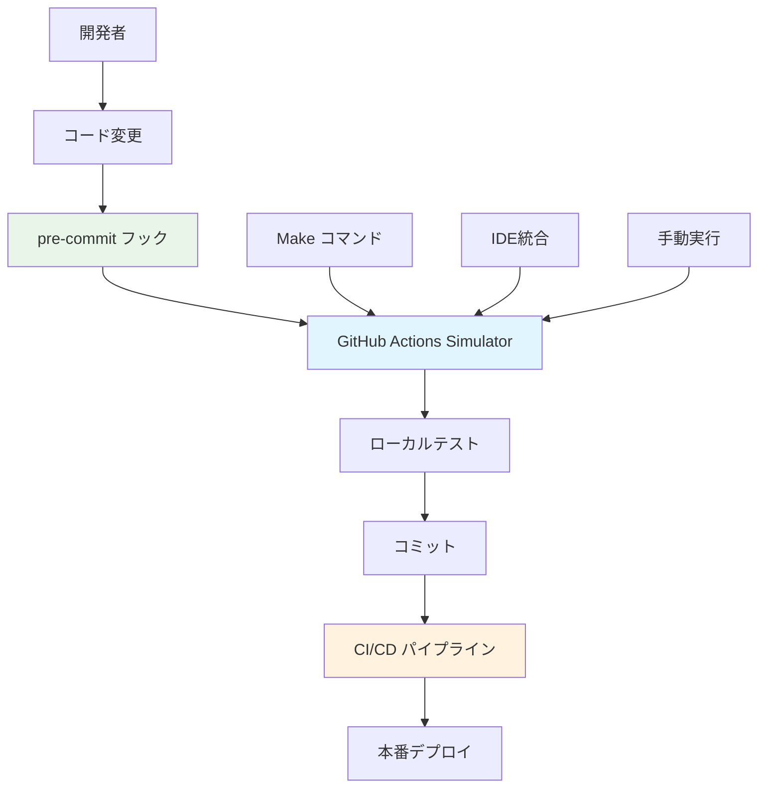

# 開発ワークフロー統合ガイド

GitHub Actions Simulator と既存の開発ワークフローの統合方法を説明します。

## 概要

このガイドでは、GitHub Actions Simulator を既存の開発プロセスにシームレスに統合する方法を詳しく説明します。pre-commit、make、CI/CD との連携例を通じて、効率的な開発ワークフローを構築できます。

## 統合アーキテクチャ

### 開発ワークフロー全体図



### 統合レベル

#### Level 1: 基本統合
- pre-commit での自動実行
- make コマンドでの手動実行
- 基本的なワークフロー検証

#### Level 2: 標準統合
- CI/CD パイプラインとの連携
- 複数環境での自動テスト
- 品質ゲートの設定

#### Level 3: 高度統合
- IDE プラグインとの連携
- カスタムフックの作成
- 自動化されたデプロイメント

## Pre-commit 統合

### 基本設定

GitHub Actions Simulator を pre-commit フックとして設定する方法：

```yaml
# .pre-commit-config.yaml
repos:
  - repo: local
    hooks:
      - id: actions-simulator-quick-check
        name: "🎭 GitHub Actions 高速チェック"
        entry: make actions-validate
        language: system
        files: ^\.github/workflows/.*\.ya?ml$
        pass_filenames: false

      - id: actions-simulator-unit-test
        name: "🧪 Actions Simulator 単体テスト"
        entry: >
          uv run pytest
          tests/test_hangup_unit.py::TestDiagnosticServiceUnit::test_diagnostic_service_initialization
          -x --tb=short --disable-warnings --timeout=30
        language: system
        files: ^(src/|tests/test_hangup_unit\.py)
        pass_filenames: false
```

### 段階的品質ゲート

#### Phase 1: 構文チェック（高速）
```yaml
- id: workflow-syntax-check
  name: "📋 ワークフロー構文チェック"
  entry: bash -c 'find .github/workflows -name "*.yml" -o -name "*.yaml" | head -5'
  language: system
  files: ^\.github/workflows/.*\.ya?ml$
  pass_filenames: false
```

#### Phase 2: 基本検証（中速）
```yaml
- id: actions-simulator-dry-run
  name: "🧪 Actions Simulator ドライラン"
  entry: make actions-dry-run WORKFLOW=.github/workflows/ci.yml
  language: system
  files: ^\.github/workflows/ci\.ya?ml$
  pass_filenames: false
```

#### Phase 3: 完全テスト（低速）
```yaml
- id: actions-simulator-full-test
  name: "🚀 Actions Simulator 完全テスト"
  entry: make actions-run WORKFLOW=.github/workflows/ci.yml
  language: system
  files: ^(src/|\.github/workflows/ci\.ya?ml)$
  pass_filenames: false
  stages: [manual]  # 手動実行時のみ
```

### カスタマイズ例

#### プロジェクト固有の検証
```yaml
- id: custom-workflow-validation
  name: "⚙️ カスタムワークフロー検証"
  entry: ./scripts/validate-custom-workflows.sh
  language: system
  files: ^\.github/workflows/.*\.ya?ml$
  pass_filenames: false
```

#### 条件付き実行
```yaml
- id: actions-simulator-conditional
  name: "🎯 条件付き Actions Simulator"
  entry: bash -c 'if [ "$ACTIONS_SIMULATOR_ENABLED" = "true" ]; then make actions-validate; fi'
  language: system
  files: ^\.github/workflows/.*\.ya?ml$
  pass_filenames: false
```

## Make コマンド統合

### 基本的な Make ターゲット

```makefile
# GitHub Actions Simulator 統合ターゲット
.PHONY: actions actions-validate actions-test actions-dev

# 対話的ワークフロー実行
actions:
	@echo "🎭 GitHub Actions Simulator - 対話的実行"
	@$(MAKE) actions-list
	@read -p "実行するワークフロー番号を選択: " choice; \
	workflow=$$(find .github/workflows -name "*.yml" -o -name "*.yaml" | sed -n "$${choice}p"); \
	if [ -n "$$workflow" ]; then \
		$(MAKE) actions-run WORKFLOW=$$workflow; \
	else \
		echo "❌ 無効な選択です"; \
	fi

# ワークフロー検証
actions-validate:
	@echo "✅ ワークフロー検証実行"
	@find .github/workflows -name "*.yml" -o -name "*.yaml" | while read workflow; do \
		echo "📋 検証中: $$workflow"; \
		docker compose --profile tools run --rm actions-simulator \
			uv run python main.py actions validate "$$workflow" || exit 1; \
	done

# 開発者向けテスト
actions-test:
	@echo "🧪 Actions Simulator テスト実行"
	@$(MAKE) test-hangup-quick
	@$(MAKE) actions-validate

# 開発環境セットアップ
actions-dev:
	@echo "🚀 Actions Simulator 開発環境セットアップ"
	@$(MAKE) setup-docker
	@$(MAKE) actions-setup
	@echo "✅ 開発環境準備完了"
```

### 高度な Make 統合

#### 環境別実行
```makefile
# 環境別 Actions Simulator 実行
actions-dev-env:
	@echo "🔧 開発環境でのワークフロー実行"
	@ACTIONS_SIMULATOR_ENV=development $(MAKE) actions-run WORKFLOW=$(WORKFLOW)

actions-staging-env:
	@echo "🎯 ステージング環境でのワークフロー実行"
	@ACTIONS_SIMULATOR_ENV=staging $(MAKE) actions-run WORKFLOW=$(WORKFLOW)

actions-prod-env:
	@echo "🏭 本番環境でのワークフロー実行"
	@ACTIONS_SIMULATOR_ENV=production $(MAKE) actions-run WORKFLOW=$(WORKFLOW)
```

#### 並列実行
```makefile
# 複数ワークフローの並列実行
actions-parallel:
	@echo "⚡ 複数ワークフロー並列実行"
	@find .github/workflows -name "*.yml" | head -3 | xargs -I {} -P 3 \
		docker compose --profile tools run --rm actions-simulator \
		uv run python main.py actions simulate {} --fail-fast
```

#### 結果レポート生成
```makefile
# Actions Simulator 実行レポート生成
actions-report:
	@echo "📊 Actions Simulator 実行レポート生成"
	@mkdir -p output/reports
	@$(MAKE) actions-validate > output/reports/validation-report.txt 2>&1
	@$(MAKE) test-hangup > output/reports/hangup-test-report.txt 2>&1
	@echo "✅ レポート生成完了: output/reports/"
```

## CI/CD 統合

### GitHub Actions での統合

#### 基本的な統合例
```yaml
name: CI with Actions Simulator

on:
  push:
    branches: [main, develop]
  pull_request:
    branches: [main]

jobs:
  validate-workflows:
    name: ワークフロー検証
    runs-on: ubuntu-latest
    steps:
      - uses: actions/checkout@v5

      - name: Actions Simulator セットアップ
        run: |
          make setup-docker
          make actions-setup

      - name: ワークフロー検証実行
        run: make actions-validate

      - name: ハングアップテスト実行
        run: make test-hangup-ci
```

#### マトリクス実行
```yaml
  test-workflows:
    name: ワークフロー テスト
    runs-on: ubuntu-latest
    strategy:
      matrix:
        workflow:
          - .github/workflows/ci.yml
          - .github/workflows/security.yml
          - .github/workflows/docs.yml
    steps:
      - uses: actions/checkout@v5

      - name: ワークフロー実行テスト
        run: |
          make actions-run WORKFLOW=${{ matrix.workflow }}
```

#### 条件付き実行
```yaml
  conditional-simulation:
    name: 条件付きシミュレーション
    runs-on: ubuntu-latest
    if: contains(github.event.head_commit.message, '[simulate]')
    steps:
      - uses: actions/checkout@v5

      - name: フルシミュレーション実行
        run: |
          make actions-test
          make actions-report
```

### Jenkins 統合

#### Jenkinsfile 例
```groovy
pipeline {
    agent any

    environment {
        ACTIONS_SIMULATOR_ENABLED = 'true'
        DOCKER_BUILDKIT = '1'
    }

    stages {
        stage('Setup') {
            steps {
                sh 'make setup-docker'
                sh 'make actions-setup'
            }
        }

        stage('Validate Workflows') {
            steps {
                sh 'make actions-validate'
            }
        }

        stage('Test Actions Simulator') {
            parallel {
                stage('Unit Tests') {
                    steps {
                        sh 'make test-hangup-unit'
                    }
                }
                stage('Integration Tests') {
                    steps {
                        sh 'make test-hangup-integration'
                    }
                }
            }
        }

        stage('Generate Report') {
            steps {
                sh 'make actions-report'
                archiveArtifacts artifacts: 'output/reports/*', fingerprint: true
            }
        }
    }

    post {
        always {
            sh 'make cleanup-hangup-test-env'
        }
    }
}
```

### GitLab CI 統合

#### .gitlab-ci.yml 例
```yaml
stages:
  - validate
  - test
  - report

variables:
  DOCKER_DRIVER: overlay2
  ACTIONS_SIMULATOR_ENGINE: act

validate_workflows:
  stage: validate
  image: docker:latest
  services:
    - docker:dind
  script:
    - make setup-docker
    - make actions-validate
  artifacts:
    reports:
      junit: output/validation-results.xml

test_actions_simulator:
  stage: test
  image: docker:latest
  services:
    - docker:dind
  script:
    - make actions-setup
    - make test-hangup-ci
  artifacts:
    paths:
      - output/test-reports/
    expire_in: 1 week

generate_report:
  stage: report
  image: docker:latest
  script:
    - make actions-report
  artifacts:
    paths:
      - output/reports/
    expire_in: 1 month
```

## IDE 統合

### VS Code 統合

#### tasks.json 設定
```json
{
    "version": "2.0.0",
    "tasks": [
        {
            "label": "Actions Simulator: ワークフロー検証",
            "type": "shell",
            "command": "make",
            "args": ["actions-validate"],
            "group": "test",
            "presentation": {
                "echo": true,
                "reveal": "always",
                "focus": false,
                "panel": "shared"
            },
            "problemMatcher": []
        },
        {
            "label": "Actions Simulator: 対話実行",
            "type": "shell",
            "command": "make",
            "args": ["actions"],
            "group": "build",
            "presentation": {
                "echo": true,
                "reveal": "always",
                "focus": true,
                "panel": "new"
            }
        },
        {
            "label": "Actions Simulator: ハングアップテスト",
            "type": "shell",
            "command": "make",
            "args": ["test-hangup-quick"],
            "group": "test",
            "presentation": {
                "echo": true,
                "reveal": "always",
                "focus": false,
                "panel": "shared"
            }
        }
    ]
}
```

#### launch.json 設定
```json
{
    "version": "0.2.0",
    "configurations": [
        {
            "name": "Actions Simulator Debug",
            "type": "python",
            "request": "launch",
            "program": "${workspaceFolder}/main.py",
            "args": [
                "actions",
                "simulate",
                ".github/workflows/ci.yml",
                "--verbose"
            ],
            "console": "integratedTerminal",
            "env": {
                "ACTIONS_SIMULATOR_DEBUG": "true",
                "ACTIONS_SIMULATOR_VERBOSE": "true"
            }
        }
    ]
}
```

### IntelliJ IDEA / PyCharm 統合

#### Run Configuration
```xml
<!-- Actions Simulator Validate -->
<component name="ProjectRunConfigurationManager">
  <configuration default="false" name="Actions Simulator Validate" type="MAKEFILE_TARGET_RUN_CONFIGURATION">
    <makefile path="$PROJECT_DIR$/Makefile"/>
    <target name="actions-validate"/>
    <workingDirectory value="$PROJECT_DIR$"/>
    <envs/>
  </configuration>
</component>
```

## カスタマイズポイント

### 1. 環境変数による制御

#### 基本設定
```bash
# .env.local (開発者固有設定)
ACTIONS_SIMULATOR_ENABLED=true
ACTIONS_SIMULATOR_ENGINE=act
ACTIONS_SIMULATOR_VERBOSE=true
ACTIONS_SIMULATOR_DEBUG=false

# タイムアウト設定
ACTIONS_SIMULATOR_TIMEOUT=300
PYTEST_TIMEOUT=180

# Docker設定
DOCKER_BUILDKIT=1
COMPOSE_DOCKER_CLI_BUILD=1
```

#### 環境別設定
```bash
# 開発環境
ACTIONS_SIMULATOR_ENV=development
ACTIONS_SIMULATOR_FAIL_FAST=false
ACTIONS_SIMULATOR_PARALLEL=true

# CI環境
ACTIONS_SIMULATOR_ENV=ci
ACTIONS_SIMULATOR_FAIL_FAST=true
ACTIONS_SIMULATOR_PARALLEL=false
ACTIONS_SIMULATOR_REPORT=true

# 本番環境
ACTIONS_SIMULATOR_ENV=production
ACTIONS_SIMULATOR_ENABLED=false
```

### 2. カスタムスクリプト作成

#### ワークフロー選択スクリプト
```bash
#!/bin/bash
# scripts/select-workflow.sh

echo "🎭 GitHub Actions Simulator - ワークフロー選択"
echo ""

workflows=$(find .github/workflows -name "*.yml" -o -name "*.yaml" | sort)
if [ -z "$workflows" ]; then
    echo "❌ ワークフローファイルが見つかりません"
    exit 1
fi

echo "📋 使用可能なワークフロー:"
echo "$workflows" | nl -w2 -s') '
echo ""

read -p "🎯 実行するワークフローを選択してください: " choice

if ! echo "$choice" | grep -Eq '^[0-9]+$'; then
    echo "❌ 無効な選択です"
    exit 1
fi

selected=$(echo "$workflows" | sed -n "${choice}p")
if [ -z "$selected" ]; then
    echo "❌ 無効な番号です"
    exit 1
fi

echo "🚀 実行ワークフロー: $selected"
make actions-run WORKFLOW="$selected"
```

#### 統合テストスクリプト
```bash
#!/bin/bash
# scripts/integration-test.sh

set -euo pipefail

echo "🔗 GitHub Actions Simulator 統合テスト"
echo "======================================"

# 環境チェック
echo "🔍 環境チェック中..."
make docker-health || {
    echo "❌ Docker環境に問題があります"
    exit 1
}

# ワークフロー検証
echo "📋 ワークフロー検証中..."
make actions-validate || {
    echo "❌ ワークフロー検証に失敗しました"
    exit 1
}

# ハングアップテスト
echo "🧪 ハングアップテスト実行中..."
make test-hangup-ci || {
    echo "❌ ハングアップテストに失敗しました"
    exit 1
}

# 統合テスト実行
echo "🚀 統合テスト実行中..."
if [ -f ".github/workflows/ci.yml" ]; then
    make actions-run WORKFLOW=.github/workflows/ci.yml || {
        echo "❌ CI ワークフローの実行に失敗しました"
        exit 1
    }
fi

echo "✅ 統合テスト完了"
```

### 3. フック拡張

#### カスタム pre-commit フック
```bash
#!/bin/bash
# .git/hooks/pre-commit.d/actions-simulator

# GitHub Actions Simulator カスタムフック

# ワークフローファイルが変更された場合のみ実行
if git diff --cached --name-only | grep -q "^\.github/workflows/"; then
    echo "🎭 GitHub Actions ワークフローの変更を検出"
    echo "📋 Actions Simulator による検証を実行中..."

    # 高速検証
    make actions-validate || {
        echo "❌ ワークフロー検証に失敗しました"
        echo "💡 修正後に再度コミットしてください"
        exit 1
    }

    # 基本テスト
    make test-hangup-quick || {
        echo "❌ 基本テストに失敗しました"
        exit 1
    }

    echo "✅ Actions Simulator 検証完了"
fi
```

#### カスタム post-commit フック
```bash
#!/bin/bash
# .git/hooks/post-commit

# コミット後の自動テスト実行

if [ "$ACTIONS_SIMULATOR_AUTO_TEST" = "true" ]; then
    echo "🚀 コミット後の自動テストを実行中..."

    # バックグラウンドで実行
    (
        sleep 5  # コミット処理完了を待機
        make test-hangup-integration > /tmp/actions-simulator-post-commit.log 2>&1

        if [ $? -eq 0 ]; then
            echo "✅ 自動テスト完了: /tmp/actions-simulator-post-commit.log"
        else
            echo "⚠️ 自動テストで問題が検出されました: /tmp/actions-simulator-post-commit.log"
        fi
    ) &
fi
```

## 拡張方法

### 1. プラグインシステム

#### プラグイン作成例
```python
# plugins/custom_validator.py

from typing import List, Dict, Any
from pathlib import Path

class CustomWorkflowValidator:
    """カスタムワークフロー検証プラグイン"""

    def __init__(self, config: Dict[str, Any]):
        self.config = config

    def validate_workflow(self, workflow_path: Path) -> List[str]:
        """ワークフローファイルのカスタム検証"""
        issues = []

        # カスタム検証ロジック
        with open(workflow_path, 'r') as f:
            content = f.read()

            # 例: 特定のアクションの使用チェック
            if 'actions/checkout@v2' in content:
                issues.append("古いバージョンのactions/checkoutが使用されています")

            # 例: セキュリティチェック
            if 'GITHUB_TOKEN' in content and 'permissions:' not in content:
                issues.append("GITHUB_TOKENを使用する場合はpermissionsを明示してください")

        return issues
```

#### プラグイン統合
```python
# main.py での統合例

from plugins.custom_validator import CustomWorkflowValidator

def load_plugins():
    """プラグインの読み込み"""
    plugins = []

    # カスタムバリデータープラグイン
    validator_config = {
        'strict_mode': True,
        'security_checks': True
    }
    plugins.append(CustomWorkflowValidator(validator_config))

    return plugins

def validate_with_plugins(workflow_path: Path):
    """プラグインを使用した検証"""
    plugins = load_plugins()
    all_issues = []

    for plugin in plugins:
        if hasattr(plugin, 'validate_workflow'):
            issues = plugin.validate_workflow(workflow_path)
            all_issues.extend(issues)

    return all_issues
```

### 2. 通知システム

#### Slack 通知
```bash
#!/bin/bash
# scripts/notify-slack.sh

WEBHOOK_URL="${SLACK_WEBHOOK_URL}"
CHANNEL="${SLACK_CHANNEL:-#dev}"

send_slack_notification() {
    local status="$1"
    local message="$2"
    local color="good"

    if [ "$status" = "failure" ]; then
        color="danger"
    elif [ "$status" = "warning" ]; then
        color="warning"
    fi

    curl -X POST -H 'Content-type: application/json' \
        --data "{
            \"channel\": \"$CHANNEL\",
            \"attachments\": [{
                \"color\": \"$color\",
                \"title\": \"GitHub Actions Simulator\",
                \"text\": \"$message\",
                \"footer\": \"$(hostname)\",
                \"ts\": $(date +%s)
            }]
        }" \
        "$WEBHOOK_URL"
}

# 使用例
if make actions-validate; then
    send_slack_notification "success" "✅ ワークフロー検証が完了しました"
else
    send_slack_notification "failure" "❌ ワークフロー検証に失敗しました"
fi
```

#### メール通知
```python
# scripts/notify-email.py

import smtplib
import sys
from email.mime.text import MIMEText
from email.mime.multipart import MIMEMultipart

def send_notification(status: str, message: str):
    """メール通知の送信"""

    # SMTP設定（環境変数から取得）
    smtp_server = os.getenv('SMTP_SERVER', 'localhost')
    smtp_port = int(os.getenv('SMTP_PORT', '587'))
    smtp_user = os.getenv('SMTP_USER')
    smtp_pass = os.getenv('SMTP_PASS')

    # メール作成
    msg = MIMEMultipart()
    msg['From'] = smtp_user
    msg['To'] = os.getenv('NOTIFICATION_EMAIL')
    msg['Subject'] = f"GitHub Actions Simulator - {status}"

    body = f"""
    GitHub Actions Simulator 実行結果

    ステータス: {status}
    メッセージ: {message}
    実行時刻: {datetime.now().isoformat()}
    ホスト: {socket.gethostname()}
    """

    msg.attach(MIMEText(body, 'plain'))

    # メール送信
    try:
        server = smtplib.SMTP(smtp_server, smtp_port)
        server.starttls()
        server.login(smtp_user, smtp_pass)
        server.send_message(msg)
        server.quit()
        print("✅ メール通知を送信しました")
    except Exception as e:
        print(f"❌ メール送信に失敗しました: {e}")

if __name__ == "__main__":
    status = sys.argv[1] if len(sys.argv) > 1 else "unknown"
    message = sys.argv[2] if len(sys.argv) > 2 else "メッセージなし"
    send_notification(status, message)
```

## ベストプラクティス

### 1. 段階的導入

#### Phase 1: 基本統合
```bash
# 最小限の統合から開始
1. make コマンドでの手動実行
2. 基本的な pre-commit フック
3. 簡単なワークフロー検証
```

#### Phase 2: 自動化拡張
```bash
# 自動化の拡張
1. CI/CD パイプラインとの統合
2. 詳細な品質ゲート設定
3. 自動レポート生成
```

#### Phase 3: 高度な統合
```bash
# 高度な機能の追加
1. カスタムプラグイン開発
2. 通知システムの構築
3. IDE との深い統合
```

### 2. パフォーマンス最適化

#### キャッシュ戦略
```bash
# Docker イメージキャッシュ
export DOCKER_BUILDKIT=1
export COMPOSE_DOCKER_CLI_BUILD=1

# uv キャッシュ
export UV_CACHE_DIR=/tmp/.uv-cache

# Actions Simulator キャッシュ
export ACTIONS_SIMULATOR_CACHE_DIR=/tmp/.actions-cache
```

#### 並列実行
```bash
# 複数ワークフローの並列検証
find .github/workflows -name "*.yml" | xargs -I {} -P 4 \
    make actions-validate WORKFLOW={}

# テストの並列実行
make test-hangup-unit &
make test-hangup-integration &
wait
```

### 3. エラーハンドリング

#### 堅牢なエラー処理
```bash
#!/bin/bash
# scripts/robust-actions-test.sh

set -euo pipefail

# エラートラップ
trap 'echo "❌ エラーが発生しました (行: $LINENO)"; cleanup; exit 1' ERR
trap 'cleanup; exit 130' INT

cleanup() {
    echo "🧹 クリーンアップ中..."
    docker compose down -v 2>/dev/null || true
    rm -f /tmp/actions-simulator-*.lock 2>/dev/null || true
}

# リトライ機能付き実行
retry_command() {
    local max_attempts=3
    local attempt=1

    while [ $attempt -le $max_attempts ]; do
        if "$@"; then
            return 0
        fi

        echo "⚠️ 試行 $attempt/$max_attempts が失敗しました"
        attempt=$((attempt + 1))
        sleep $((attempt * 2))
    done

    echo "❌ $max_attempts 回の試行後に失敗しました"
    return 1
}

# メイン処理
main() {
    echo "🚀 堅牢な Actions Simulator テスト開始"

    retry_command make setup-docker
    retry_command make actions-validate
    retry_command make test-hangup-ci

    echo "✅ テスト完了"
}

main "$@"
```

### 4. 監視とログ

#### 構造化ログ
```python
# scripts/structured-logging.py

import json
import logging
from datetime import datetime

class StructuredLogger:
    """構造化ログ出力"""

    def __init__(self, name: str):
        self.logger = logging.getLogger(name)
        self.logger.setLevel(logging.INFO)

        handler = logging.StreamHandler()
        handler.setFormatter(logging.Formatter('%(message)s'))
        self.logger.addHandler(handler)

    def log_event(self, event: str, status: str, **kwargs):
        """イベントログの出力"""
        log_data = {
            'timestamp': datetime.utcnow().isoformat(),
            'event': event,
            'status': status,
            'service': 'actions-simulator',
            **kwargs
        }

        self.logger.info(json.dumps(log_data))

# 使用例
logger = StructuredLogger('actions-simulator')

logger.log_event(
    event='workflow_validation',
    status='success',
    workflow='.github/workflows/ci.yml',
    duration_ms=1250
)
```

#### メトリクス収集
```bash
#!/bin/bash
# scripts/collect-metrics.sh

METRICS_FILE="/tmp/actions-simulator-metrics.json"

collect_metrics() {
    local start_time=$(date +%s)
    local workflow="$1"

    # メトリクス実行
    make actions-run WORKFLOW="$workflow" 2>&1 | tee /tmp/actions-output.log
    local exit_code=$?

    local end_time=$(date +%s)
    local duration=$((end_time - start_time))

    # メトリクス記録
    cat >> "$METRICS_FILE" << EOF
{
  "timestamp": "$(date -u +%Y-%m-%dT%H:%M:%SZ)",
  "workflow": "$workflow",
  "duration_seconds": $duration,
  "exit_code": $exit_code,
  "success": $([ $exit_code -eq 0 ] && echo "true" || echo "false")
}
EOF

    return $exit_code
}

# 使用例
collect_metrics ".github/workflows/ci.yml"
```

## トラブルシューティング

### よくある問題と解決方法

#### 1. Docker 関連の問題
```bash
# Docker デーモンが起動していない
sudo systemctl start docker

# 権限の問題
sudo usermod -aG docker $USER
newgrp docker

# Docker Compose の問題
docker compose version
pip install docker-compose
```

#### 2. 依存関係の問題
```bash
# uv の問題
curl -LsSf https://astral.sh/uv/install.sh | sh
source ~/.bashrc

# Python 環境の問題
uv sync --reinstall
rm -rf .venv && uv sync
```

#### 3. パフォーマンスの問題
```bash
# Docker リソースの確認
docker system df
docker system prune -f

# システムリソースの確認
free -h
df -h
```

#### 4. 統合の問題
```bash
# pre-commit の問題
pre-commit clean
pre-commit install --install-hooks

# Make の問題
make --version
which make
```

## 関連ドキュメント

- [Pre-commit Integration Guide](./PRE_COMMIT_INTEGRATION.md)
- [Docker Customization Guide](./DOCKER_CUSTOMIZATION_GUIDE.md)
- [Troubleshooting Guide](./TROUBLESHOOTING.md)
- [Actions User Guide](./actions/USER_GUIDE.md)
- [API Reference](./API_REFERENCE.md)

## サポート

統合に関する問題や質問がある場合：

1. [トラブルシューティングガイド](./TROUBLESHOOTING.md) を確認
2. [FAQ](./actions/FAQ.md) を参照
3. [GitHub Issues](https://github.com/your-repo/issues) で報告
4. [診断ツール](./DIAGNOSTIC_COMMANDS.md) を実行

---

このガイドにより、GitHub Actions Simulator を既存の開発ワークフローにシームレスに統合し、効率的な開発プロセスを構築できます。
