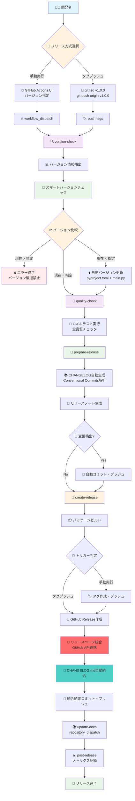
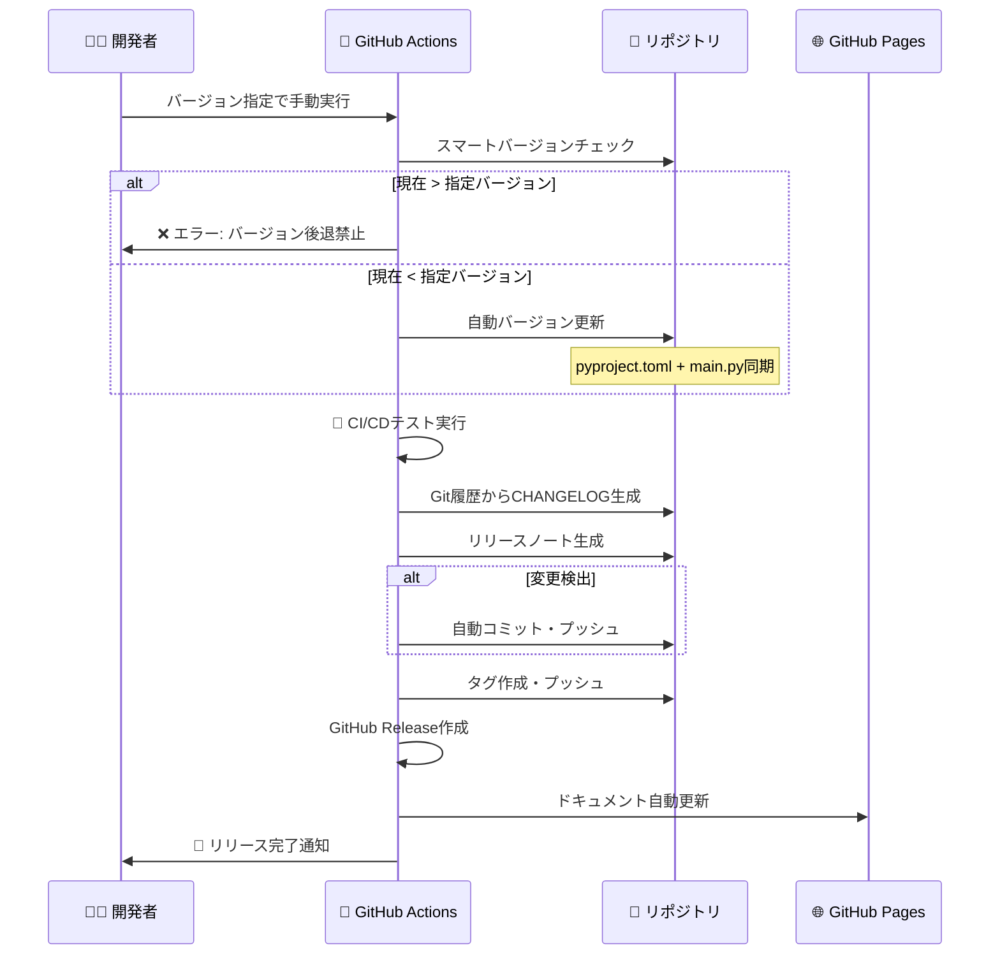
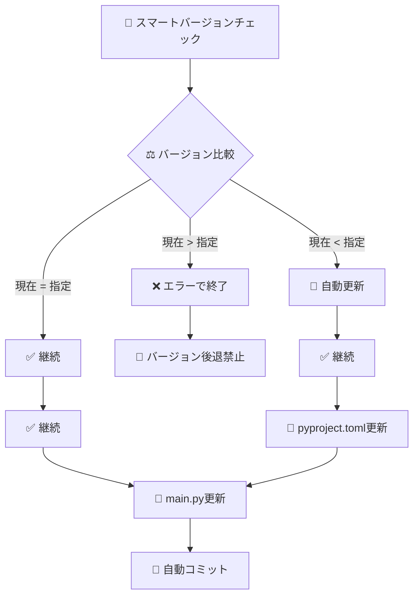
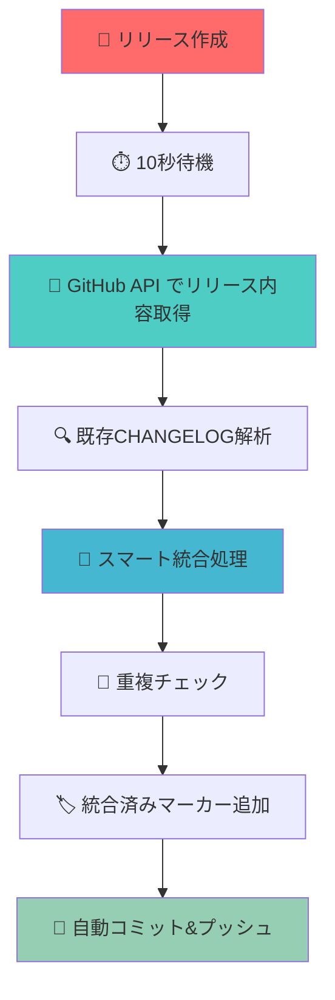

# 🚀 MCP Docker Environment - リリース自動化システム完全ガイド

## 📋 システム概要

MCP Docker Environmentプロジェクトの次世代リリース自動化システムは、開発からリリースまでの全工程を完全自動化するCI/CDパイプラインです。GitHub Actionsを中心とした統合システムにより、品質保証・バージョン管理・ドキュメント生成・リリース作成のすべてを自動化します。

## 🎯 システム特徴

### 🔥 完全自動化機能

- **🚀 ワンクリックリリース**: GitHub Actions UIから完全自動実行
- **🔄 スマートバージョン管理**: pyproject.toml ↔ main.py 自動同期
- **📝 インテリジェントCHANGELOG**: Git履歴からConventional Commits解析
- **🏗️ 統合ドキュメント**: Sphinx + GitHub Pages自動デプロイ
- **🛡️ セキュリティ保証**: バージョン後退禁止・権限管理
- **📡 リリースページ統合**: GitHub Release ↔ CHANGELOG.md 完全自動同期

### 🎛️ 多様なトリガー

- **手動実行** (`workflow_dispatch`): GitHub Actions UI操作
- **タグプッシュ** (`push: tags`): `git tag v1.0.0 && git push origin v1.0.0`
- **ドキュメント連動** (`repository_dispatch`): リリース時自動更新

### 🧠 インテリジェント処理

- **バージョン整合性チェック**: 自動検証・同期
- **品質保証統合**: CI/CDテスト完全連携
- **変更履歴自動分類**: 機能・修正・ドキュメント・その他
- **リリースノート生成**: CHANGELOG抽出・GitHub Release統合

## 🔄 完全自動化フローチャート



## 🚀 手動リリース実行（推奨方式）

### 📋 実行手順

1. **🌐 GitHub Actions画面へ移動**

   ```bash
   https://github.com/scottlz0310/Mcp-Docker/actions
   ```

2. **🎯 ワークフロー選択**
   - **「🚀 Release Management」**を選択

3. **▶️ ワークフロー実行**
   - **「Run workflow」**ボタンをクリック

4. **📝 パラメータ設定**
   - **`version`**: 新しいバージョン (例: `1.3.7`, `2.0.0`)
   - **`prerelease`**: プレリリースフラグ (`true`/`false`)

5. **🚀 実行開始**
   - **「Run workflow」**で自動化開始

### 🎢 処理シーケンス



## 🏷️ タグプッシュリリース（開発者向け）

### 💻 実行コマンド

```bash
# 1. タグ作成
git tag v1.3.7

# 2. タグプッシュでリリース実行
git push origin v1.3.7
```

### 🔧 高度な使用例

```bash
# プレリリースタグ
git tag v1.4.0-beta.1
git push origin v1.4.0-beta.1

# メジャーバージョンアップ
git tag v2.0.0
git push origin v2.0.0
```

## 🔧 5段階ジョブ詳細解析

### 1️⃣ version-check ジョブ

**🎯 目的**: スマートバージョンチェックと自動更新

**⚡ 処理内容**:

- トリガー種別の判定（手動 or タグプッシュ）
- バージョン情報の抽出
- プレリリースフラグの判定
- **スマートバージョンチェック**:
  - 現在 > 指定: エラーで終了
  - 現在 = 指定: 継続
  - 現在 < 指定: 自動更新

**📤 出力**:

- `version`: 対象バージョン
- `is-prerelease`: プレリリースフラグ

### 2️⃣ quality-check ジョブ

**🎯 目的**: 統合品質保証

**⚡ 処理内容**:

- CI/CDワークフロー（ci.yml）の実行
- セキュリティスキャン・lintチェック
- テストスイート実行・カバレッジ検証

### 3️⃣ prepare-release ジョブ

**🎯 目的**: リリース準備とドキュメント生成

**⚡ 処理内容**:

1. **CHANGELOG自動生成・更新**
   - Git履歴からConventional Commitsを解析
   - カテゴリ別に変更内容を分類
   - 既存エントリがあれば日付のみ更新

2. **リリースノート生成**
   - CHANGELOGから該当バージョンを抽出
   - GitHub Release用のマークダウン生成

3. **自動コミット**
   - 変更があれば自動コミット・プッシュ

**📤 出力**:

- `changes-made`: 変更有無フラグ

### 4️⃣ create-release ジョブ

**🎯 目的**: GitHub Release作成とパッケージ配布

**⚡ 処理内容**:

1. **パッケージビルド**
   - tar.gz形式でソースディストリビューション作成
   - 必要ファイルの自動選択・除外

2. **GitHub Release作成**
   - タグ作成・プッシュ（手動実行時のみ）
   - Release作成・ファイルアップロード
   - リリースノート自動添付

3. **🚀 リリースページ統合（New!）**
   - GitHub APIでリリース内容を取得
   - CHANGELOG.mdとの自動統合処理
   - 既存内容の保持とスマート統合
   - 統合済みマーカーの自動追加
   - 自動コミット・プッシュ実行

### 5️⃣ update-docs & post-release ジョブ

**🎯 目的**: ドキュメント更新とメトリクス記録

**⚡ 処理内容**:

- リリースメトリクスの記録
- ドキュメントワークフローのトリガー（repository_dispatch）
- リリース完了通知

## 🧠 スマートバージョンチェック

### ⚖️ バージョン比較ロジック



### 📊 具体例

| 現在バージョン | 指定バージョン | 動作 | 結果 |
|---|---|---|---|
| 1.3.5 | 1.4.0 | 🔄 自動更新 | ✅ 1.3.5 → 1.4.0 |
| 1.4.0 | 1.4.0 | ✅ 継続 | ✅ 更新不要 |
| 1.5.0 | 1.4.0 | ❌ エラー | ❌ バージョン後退禁止 |
| 2.0.0 | 1.9.0 | ❌ エラー | ❌ バージョン後退禁止 |

### 🔒 セキュリティ機能

- **バージョン後退禁止**: セキュリティ上の理由でダウングレードを禁止
- **自動アップグレード**: 安全なバージョンアップのみ許可
- **一貫性保証**: pyproject.tomlとmain.pyの同期更新

## 📝 インテリジェントCHANGELOG生成

### 🚀 自動統合システム（New!）

**リリースページ ↔ CHANGELOG.md 完全自動統合**を実現：

- **📡 GitHub API連携**: リリース作成後、APIから自動的にリリース内容を取得
- **🧠 インテリジェント統合**: 既存の詳細説明を保持しつつ、リリースページの自動生成内容を統合
- **🔄 重複防止**: 同じ内容の重複を避けるスマートチェック機能
- **🏷️ 同期マーカー**: 統合済みを示すタイムスタンプ付きマーカー
- **💾 安全性**: 更新前の自動バックアップ機能

### 🔄 統合フローチャート



### 🏷️ Conventional Commits対応

以下のコミット形式を自動認識・分類：

- `feat:` → ✨ 新機能
- `fix:` → 🐛 修正
- `docs:` → 📝 ドキュメント
- `refactor:` → 🔄 変更
- その他 → 🔧 その他

### 📄 生成例

```markdown
## [1.3.7] - 2025-09-24

### ✨ 新機能
- 完全自動化リリースシステム実装
- スマートバージョン管理機能追加
- リアルタイムドキュメント自動更新

### 🐛 修正
- CI/CDパイプライン安定性向上
- バージョン整合性チェック改善

### 📝ドキュメント
- リリースガイド完全刷新
- API仕様書自動生成統合

### 🔧 その他
- 依存関係最新化
- セキュリティ設定強化
```

### 💡 統合結果例

**自動統合前（CHANGELOG.md）**:

```markdown
## [1.1.0] - 2025-09-24

### 🚀 完全自動化リリースシステム
- GitHub Actions 5段階ジョブ構成による完全自動化
- スマートバージョン管理機能
```

**リリースページ内容（自動生成）**:

```markdown
### ✨ 新機能
- Improve testing infrastructure and package management
- integrate documentation auto-update with release workflow

### 🐛 修正
- resolve CI test failure in UID validation
```

**統合後（自動更新されたCHANGELOG.md）**:

```markdown
## [1.1.0] - 2025-09-24

### ✨ 新機能
- Improve testing infrastructure and package management
- integrate documentation auto-update with release workflow

### 🐛 修正
- resolve CI test failure in UID validation

### 📋 詳細機能説明

### 🚀 完全自動化リリースシステム
- GitHub Actions 5段階ジョブ構成による完全自動化
- スマートバージョン管理機能

<!-- リリースページ統合済み: 2025-09-24 -->
```

## 🎯 使い分けガイド

### 🚀 手動リリース（推奨）

**📈 適用場面**:

- 定期リリース
- 機能リリース
- 緊急修正リリース

**🎊 メリット**:

- GitHub UI画面で簡単実行
- バージョン指定が明確
- プレリリースフラグ制御可能
- ワークフロー実行状況の可視化

### 🏷️ タグプッシュリリース

**📈 適用場面**:

- ローカル開発環境からのリリース
- CI/CDパイプライン統合
- 自動化スクリプトとの連携

**🎊 メリット**:

- コマンドライン完結
- 既存Gitワークフローとの統合
- バッチ処理対応

## 🔍 トラブルシューティング

### ❓ よくある問題と解決方法

1. **バージョン後退エラー**
   - 現在のバージョンより小さい値を指定
   - 解決: より大きいバージョン番号を指定

2. **CI/CDテスト失敗**
   - 品質チェックで問題検出
   - 解決: ローカルで問題修正後に再実行

3. **CHANGELOG生成が空**
   - Git履歴にConventional Commitsがない
   - 解決: フォールバック機能により最小限の内容を生成

4. **タグが重複**
   - 既存タグと同じバージョン指定
   - 解決: 既存タグの確認・削除後に再実行

### 🛠️ デバッグ方法

1. **ワークフローログの確認**
   - GitHub Actions画面でログ詳細を確認
   - 各ジョブの実行結果をチェック

2. **ローカルでのテスト**

   ```bash
   # バージョン管理スクリプトのテスト
   uv run python scripts/version-manager.py --check
   uv run python scripts/version-manager.py --smart-check 1.3.7
   uv run python scripts/version-manager.py --update-changelog 1.3.7
   ```

3. **YAML構文チェック**

   ```bash
   # ローカルでYAML構文確認
   yamllint .github/workflows/release.yml
   ```

## 🔧 ローカル開発コマンド

### 📦 バージョン管理

```bash
# 現在のバージョン確認
make version

# バージョン同期
make version-sync

# リリース準備状況チェック
make release-check
```

### 📚 ドキュメント管理

自動生成ドキュメントのワークフローは退役しました。Sphinx プロジェクトは `archive/docs/sphinx/` に保管してあるため、必要に応じて個別に `sphinx-build` を実行してください。

### 🧪 テスト実行

```bash
# 全テスト実行
make test-all

# セキュリティスキャン
make security

# 品質チェック
make lint
```

## 🌐 システム連携

### 📚 ドキュメント自動化（退役）

- **Sphinx**: API文書自動生成（現在は `archive/docs/sphinx/` に退避）
- **GitHub Pages**: 自動デプロイ・公開（ワークフロー停止中）
- **repository_dispatch**: リリース連動更新（停止中）

### 🔒 セキュリティ統合

- **Branch Protection**: 必須チェック設定
- **SBOM生成**: 依存関係透明性
- **脆弱性監査**: 自動依存関係チェック

### 📊 メトリクス・監視

- **リリース頻度**: 自動記録
- **品質指標**: テストカバレッジ・成功率
- **パフォーマンス**: ビルド時間・実行時間

## 📚 関連ドキュメント・リソース

- **📋 開発ガイド**: [README.md](../README.md#開発・テスト)
- **🔒 セキュリティガイド**: [SECURITY.md](../SECURITY.md)
- **📝 変更履歴**: [CHANGELOG.md](../CHANGELOG.md)
- **🤝 コントリビューション**: [CONTRIBUTING.md](../CONTRIBUTING.md)

## 🎉 まとめ

MCP Docker Environment のリリース自動化システムは、現代的なCI/CD のベストプラクティスを統合した完全自動化ソリューションです。このシステムにより、開発者は品質の高いソフトウェアを効率的に、そして安全にリリースできます。

**🚀 次世代の特徴**:

- ワンクリック完全自動化
- インテリジェントな品質保証
- セキュアなバージョン管理
- 統合ドキュメント自動化（退役済み）
- 完全な監査可能性

このシステムを活用することで、開発チームはリリース作業にかかる時間を大幅に削減し、よりクリエイティブな開発作業に集中できます。🎊
