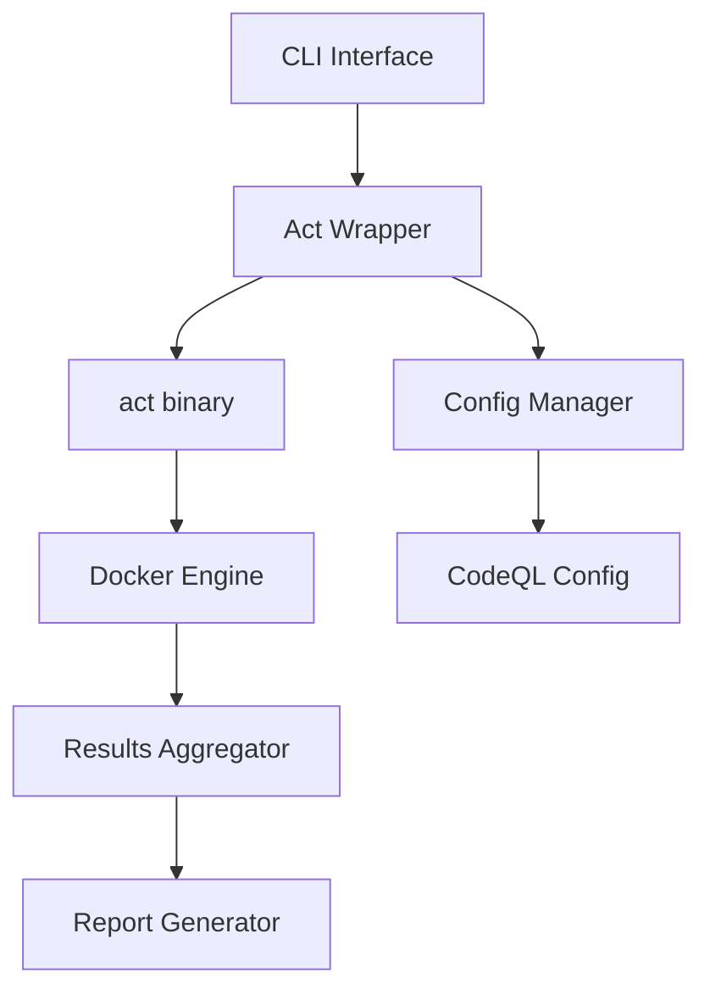

# Act統合によるGitHub Actions Simulator設計書
<!-- markdownlint-disable -->

> ℹ️ 2025-09-27 時点でローカル CodeQL サービスはアーカイブ (`archive/services/codeql/`) に移行済みです。本ドキュメントの CodeQL 記述は歴史的背景および将来再導入時の参考情報として残しています。

## 🎯 設計決定：新規独立サービス `actions` + act統合アプローチ

### 選択根拠

既存のMcp-Dockerプロジェクト構成分析に基づく最適アプローチ：

#### ✅ 新規独立サービスのメリット
1. **責任分離**: 静的解析系コンポーネント（旧CodeQLサービス）と Actions Simulator（CI実行）は役割が異なるため切り離しやすい
2. **既存パターン踏襲**: `services/github/`, `services/datetime/`と同様の構造
3. **統一管理**: `main.py`の既存サービスパターンに自然に統合
4. **独立性**: 各サービスが独立して機能、メンテナンスが容易

#### ✅ act統合のメリット
1. **成熟度**: 40,000+ GitHub stars、実戦実績
2. **互換性**: GitHub Actions 90%+ 互換
3. **メンテナンス**: コミュニティベース、継続開発
4. **機能豊富**: Matrix strategy、secrets、environmentsサポート

#### 📋 既存サービス構成
```
services/
├── github/         # GitHub MCP Server
├── datetime/       # DateTime Validator
└── actions/        # GitHub Actions Simulator (CI実行)

archive/services/
└── codeql/         # 旧 CodeQL Analysis 設定（2025-09-27 アーカイブ）
```

## 🏗️ アーキテクチャ設計

### システム構成



### コンポーネント詳細

#### 1. Act Wrapper（核心コンポーネント）
```python
# services/actions/act_wrapper.py
class ActWrapper:
    """act binaryのPythonラッパー"""

    def __init__(self, config_path: str = "services/actions/config.yml"):
        self.config = self._load_config(config_path)
        self.act_binary = self.config.get("act_binary", "/usr/local/bin/act")

    async def simulate_workflow(self,
                               workflow_path: str,
                               event: str = "push",
                               **options) -> ExecutionResult:
        """ワークフロー実行のメインエントリーポイント"""
        cmd = self._build_act_command(workflow_path, event, **options)
        return await self._execute_act(cmd)
```

#### 2. 統合CLI設計
```python
# services/actions/cli.py
import click
from rich.console import Console

@click.group(name="actions")
def actions_cli():
    """GitHub Actions Simulator (powered by act)"""
    pass

@actions_cli.command()
@click.argument("workflow_file")
@click.option("--event", default="push")
def simulate(workflow_file: str, event: str):
    """Execute GitHub Actions workflow locally"""
    wrapper = ActWrapper()
    result = wrapper.simulate_workflow(workflow_file, event=event)
    console.print(f"✅ Simulation completed: {result.status}")
```

## 🔧 実装詳細

### main.py統合

既存パターンに従った最小限の変更：

```python
# main.py（既存コードに追加）
elif service == "actions":
    # GitHub Actions Simulator (新規独立サービス)
    from services.actions.cli import actions_cli
    # sys.argvを調整してclick引数として渡す
    import sys
    sys.argv = ["actions"] + sys.argv[2:]  # service引数を除去
    actions_cli()
```

### docker-compose.yml拡張

```yaml
# docker-compose.yml（新規サービス追加）
services:
  # 既存サービス...
  github-mcp: # ...
  datetime-validator: # ...
  codeql: # ...

  # 新規追加
  actions-simulator:
    build: .
    container_name: mcp-actions
    volumes:
      - ~/workspace:/workspace:ro
      - ./.github:/app/.github:ro
      - /var/run/docker.sock:/var/run/docker.sock  # act用
    environment:
      - ACT_RUNNER_IMAGE=ghcr.io/catthehacker/ubuntu:act-latest
    command: python main.py actions --help
    networks:
      - mcp-network
```

### 新規サービス設定ファイル

```yaml
# services/actions/config.yml（新規作成）
---
name: actions-simulator
version: 1.0.0
description: GitHub Actions Simulator powered by act

runtime:
  act_binary: "/usr/local/bin/act"
  default_event: "push"
  default_runner: "ubuntu-latest"
  max_parallel_jobs: 4
  timeout: "30m"

runners:
  ubuntu-latest: "ghcr.io/catthehacker/ubuntu:act-latest"
  ubuntu-22.04: "ghcr.io/catthehacker/ubuntu:act-22.04"
  ubuntu-20.04: "ghcr.io/catthehacker/ubuntu:act-20.04"

security:
  network_access: false
  allow_privileged: false
  secret_masking: true
  resource_limits:
    memory: "2g"
    cpu: "2"

output:
  format: "rich"
  log_level: "info"
  save_logs: true
  output_dir: "/workspace/simulation-output"
```

## 📦 act バイナリ管理

### Dockerfileへの統合

```dockerfile
# Dockerfile（既存イメージにact追加）
FROM node:24-alpine AS base

# 既存の設定...
RUN addgroup -g 1001 -S mcp && \
    adduser -S mcp -u 1001 -G mcp

# act CLI追加
RUN curl -L -o /tmp/act.tar.gz \
    "https://github.com/nektos/act/releases/latest/download/act_Linux_x86_64.tar.gz" && \
    tar -xzf /tmp/act.tar.gz -C /usr/local/bin act && \
    chmod +x /usr/local/bin/act && \
    rm /tmp/act.tar.gz

# 既存のビルド処理...
```

### Python act管理

```python
# services/codeql/actions_simulator/act_manager.py
import subprocess
import shutil
from pathlib import Path

class ActManager:
    """act binary管理"""

    def __init__(self):
        self.act_path = shutil.which("act") or "/usr/local/bin/act"

    def ensure_act_available(self) -> bool:
        """act availability check"""
        if not Path(self.act_path).exists():
            return self._install_act()
        return True

    def get_version(self) -> str:
        """actバージョン取得"""
        try:
            result = subprocess.run(
                [self.act_path, "--version"],
                capture_output=True,
                text=True,
                check=True
            )
            return result.stdout.strip()
        except subprocess.CalledProcessError:
            return "unknown"

    def _install_act(self) -> bool:
        """自動インストール（開発時のみ）"""
        # 本番環境では事前インストール前提
        console.print("⚠️ act binary not found. Please install act manually.")
        return False
```

## 🚀 使用例・コマンドライン

### 基本的な使用方法

```bash
# 1. 既存パターンでの起動
python main.py actions simulate .github/workflows/ci.yml

# 2. Makefileターゲット（追加予定）
make actions-sim WORKFLOW=ci.yml

# 3. Docker Compose（拡張）
docker compose run codeql python main.py actions simulate ci.yml

# 4. 詳細オプション
python main.py actions simulate ci.yml \
  --event pull_request \
  --job test \
  --verbose \
  --output-format json
```

### 高度な使用例

```bash
# デバッグモード
python main.py actions simulate ci.yml --dry-run --verbose

# 特定ジョブ実行
python main.py actions simulate ci.yml --job build

# 環境変数指定
ACT_RUNNER_IMAGE=ubuntu:22.04 python main.py actions simulate ci.yml

# レポート生成
python main.py actions simulate ci.yml --output-file report.html
```

## 📊 期待される利点

### 開発効率
- **既存コードベース**: 最小限の変更で統合
- **学習コスト**: 既存パターン踏襲で低コスト
- **メンテナンス**: 単一コードベースで管理効率化

### 技術的利点
- **信頼性**: act の実戦実績活用
- **互換性**: GitHub Actions 90%+ 互換性
- **拡張性**: act のエコシステム活用

### 運用利点
- **統一CLI**: `python main.py <service>` パターン継続
- **設定統合**: 単一config.ymlでの管理
- **テスト統合**: 既存batsテストとの統合

## ⚠️ 制限事項と対策

### act の制限事項
1. **GitHub固有サービス**: Container Registry等は未対応
   - **対策**: モックまたは代替サービス提供
2. **大きなイメージサイズ**: ランナーイメージが大容量
   - **対策**: イメージキャッシュ、選択的ダウンロード
3. **起動時間**: 初回実行の遅延
   - **対策**: プリウォーム、バックグラウンドプル

### 技術的制約
1. **Docker依存**: act はDockerが必須
   - **現状**: 既存プロジェクトもDocker前提のため問題なし
2. **Linux専用**: Windows/macOS runner未対応
   - **対策**: Linuxコンテナでの統一実行

## 🎯 次のステップ

### Phase 1: プロトタイプ（1週間）
- [ ] act統合のPoC作成
- [ ] 既存CodeQL設定との統合確認
- [ ] 基本CLI実装

### Phase 2: 本格実装（3週間）
- [ ] 全機能実装
- [ ] テストスイート追加
- [ ] ドキュメント整備

### Phase 3: 統合・公開（1週間）
- [ ] 既存CIとの統合
- [ ] パフォーマンス最適化
- [ ] リリース準備

**推奨**: この設計でプロトタイプを作成し、実際の使用感を確認した後、詳細仕様を決定する段階的アプローチ。
