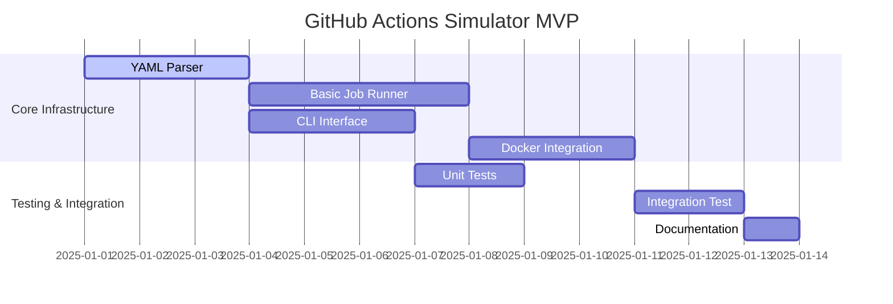

# GitHub Actions Simulator - 実装計画書

## プロジェクト概要

既存のMcp-Dockerプロジェクトに、GitHub ActionsワークフローをDockerベースでローカル実行・検証する「CI事前チェック機能」を追加実装します。

## 実装戦略

### 段階的開発アプローチ

#### フェーズ1: MVP（Minimum Viable Product） - 2週間
**目標**: 基本的なワークフロー実行機能の実装

##### 主要機能
1. **YAML解析エンジン**
   - `.github/workflows/*.yml`ファイル読み込み
   - 基本的なワークフロー構造の解析
   - 簡単なバリデーション

2. **シンプルジョブ実行**
   - 単一ジョブの Sequential実行
   - `ubuntu-latest`ランナーのみサポート
   - `run:`ステップの実行

3. **基本CLI**
   - `mcp-docker simulate <workflow-file>`コマンド
   - 実行ログのコンソール出力
   - 基本的なエラーハンドリング

##### 技術選択
- **YAML Parser**: `pyyaml`（Python標準的選択）
- **Docker API**: `docker-py`ライブラリ
- **CLI Framework**: `click`（軽量、高機能）
- **ログ**: 標準`logging`モジュール

##### 成功条件
- 既存プロジェクトの`ci.yml`ワークフローのlintジョブが実行可能
- 実行結果（成功/失敗）が正確に報告される
- 5分以内に実行完了

#### フェーズ2: 拡張機能 - 3週間
**目標**: 実用的なCI/CD環境の実現

##### 主要機能
1. **高度なワークフロー機能**
   - 複数ジョブの依存関係実行（`needs:`）
   - 並列実行サポート
   - Matrix strategy（`strategy.matrix`）
   - 条件実行（`if:`）

2. **環境管理**
   - 環境変数サポート（`env:`）
   - Secrets管理（ローカルファイルベース）
   - 複数ランナーイメージ（ubuntu-20.04, 22.04）

3. **Actions実行**
   - `uses:`でのGitHub Actions実行
   - 人気アクション対応（checkout, setup-node, cache等）
   - カスタムアクション設定

4. **結果レポート**
   - 詳細実行ログ
   - HTML形式レポート生成
   - 実行時間・リソース統計

##### 技術拡張
- **並列実行**: `concurrent.futures`または`asyncio`
- **レポート**: `jinja2`テンプレート
- **設定管理**: `configparser`または`toml`

##### 成功条件
- 既存プロジェクトの全GitHub Actionsワークフローが動作
- 実際のGitHub Actions実行時間の70%以内で完了
- 詳細なエラー診断とデバッグ情報提供

#### フェーズ3: 統合・最適化 - 2週間
**目標**: プロダクション品質の実現

##### 主要機能
1. **既存システム統合**
   - 現在の`main.py`サービス起動システムとの統合
   - `docker-compose.yml`での新サービス定義
   - 既存MCPサービス（github, datetime, codeql）との連携

2. **パフォーマンス最適化**
   - Dockerイメージキャッシュ最適化
   - 段階的ビルド戦略
   - 並列実行の効率化

3. **開発者体験向上**
   - VS Code拡張（オプション）
   - Git hooks統合
   - 実行結果の永続化

##### 品質保証
- 単体テスト（pytest）
- 統合テスト（実際のワークフロー）
- パフォーマンステスト
- セキュリティ監査

## 技術スタック（改訂版）

### Architecture Decision: CodeQL拡張 + act統合

既存のMcp-Dockerプロジェクト分析により、**CodeQLサービス拡張アプローチ**を採用：

#### 選択理由
1. **既存統合**: `services/codeql/`ディレクトリが存在、`main.py`でサービス管理
2. **一貫性**: 現在の`github`、`datetime`、`codeql`サービスパターンに適合
3. **リソース効率**: 独立サービスより軽量
4. **メンテナンス性**: 単一コードベースでの管理

### Core Technologies
```yaml
Language: Python 3.12+ (既存プロジェクトと統一)
CLI Framework: Click + Rich (美しいコンソール出力)
Backend Engine: act (nektos/act) + Python wrapper
Container Runtime: Docker Engine (既存インフラ活用)
YAML Processing: PyYAML
Configuration: 既存config.ymlパターン踏襲
Testing: Bats + pytest (既存テスト戦略と統一)
```

### Dependencies（既存pyproject.tomlベース）
```toml
[tool.poetry.dependencies]  # 既存に追加
python = "^3.12"
click = "^8.1.0"           # 新規追加
pyyaml = "^6.0"           # 既存依存関係活用
rich = "^13.0.0"          # 新規追加：美しい出力
pydantic = "^2.0.0"       # 新規追加：型安全性

# act binary管理（Python経由）
act-cli = "^1.17.0"       # act Python wrapper

[tool.poetry.group.dev.dependencies]
pytest = "^7.4.0"         # 既存
bats = "^1.10.0"          # 既存テストフレームワーク統一
```

## ファイル構造（改訂版：新規独立サービス `actions`）

### 新規サービス追加
```
services/actions/             # 新規独立サービス
├── __init__.py
├── cli.py                   # メインCLIエントリーポイント
├── act_wrapper.py           # act統合ラッパー
├── codeql_integration.py    # 🆕 既存CodeQL統合
├── workflow_parser.py       # YAML解析（act補完）
├── config_manager.py        # 設定管理
├── report_generator.py      # 結果レポート生成
├── config.yml              # サービス設定ファイル
├── models/                 # データモデル
│   ├── __init__.py
│   ├── workflow.py        # ワークフローモデル
│   └── execution.py       # 実行状態モデル
└── tests/                  # テストファイル（batsパターン）
    ├── test_actions_simulator.bats
    ├── fixtures/
    │   └── sample_workflows/
    └── integration/
        └── test_full_simulation.bats
```

### 既存ファイル変更（最小限）
```
main.py                     # elif service == "actions": 追加
docker-compose.yml          # actions-simulator サービス追加
Dockerfile                 # act binary追加
Makefile                   # actions ターゲット追加
README.md                  # サービス説明追加
```

### 既存サービス構成（変更なし）
```
services/
├── github/                 # GitHub MCP Server（既存）
├── datetime/              # DateTime Validator（既存）
├── codeql/                # CodeQL Analysis（既存・変更なし）
└── actions/               # 🆕 GitHub Actions Simulator
```

## 開発工程

### Week 1-2: MVP実装


### Week 3-5: 拡張機能
- **Week 3**: 並列実行・依存関係処理
- **Week 4**: Actions統合・環境管理
- **Week 5**: レポート生成・エラーハンドリング

### Week 6-7: 品質向上・統合
- **Week 6**: 既存システム統合・パフォーマンス最適化
- **Week 7**: テスト拡充・ドキュメント・リリース準備

## テスト戦略

### 単体テスト
```python
# tests/test_workflow_parser.py
def test_parse_simple_workflow():
    yaml_content = """
    name: CI
    on: [push]
    jobs:
      test:
        runs-on: ubuntu-latest
        steps:
          - run: echo "Hello World"
    """
    workflow = WorkflowParser.parse(yaml_content)
    assert workflow.name == "CI"
    assert len(workflow.jobs) == 1
```

### 統合テスト
```python
# tests/integration/test_full_workflow.py
@pytest.mark.integration
def test_full_ci_workflow():
    """実際のci.ymlワークフローの実行テスト"""
    result = simulate_workflow('.github/workflows/ci.yml')
    assert result.success
    assert 'lint' in result.completed_jobs
    assert 'build' in result.completed_jobs
```

### パフォーマンステスト
```python
# tests/test_performance.py
def test_execution_time_under_threshold():
    """実行時間が許容範囲内であることを確認"""
    start_time = time.time()
    simulate_workflow('tests/fixtures/medium_workflow.yml')
    execution_time = time.time() - start_time
    assert execution_time < 300  # 5分以内
```

## セキュリティ考慮事項

### コンテナセキュリティ
1. **非root実行**: 全てのランナーコンテナは非rootユーザーで実行
2. **ネットワーク隔離**: 独立したDocker networkでの実行
3. **リソース制限**: CPU、メモリ、ディスク使用量の制限
4. **読み取り専用マウント**: 必要最小限のファイルシステムアクセス

### シークレット管理
1. **ローカル暗号化**: `.env.secrets`ファイルの暗号化保存
2. **環境変数注入**: コンテナ起動時のみシークレット注入
3. **ログマスキング**: 実行ログでの機密情報自動マスキング
4. **一時ファイル削除**: 実行完了後の機密情報削除

### アクセス制御
```python
# セキュリティ設定例
SECURITY_CONFIG = {
    "allow_network_access": False,  # デフォルトはネットワークアクセス禁止
    "allowed_actions": [            # 許可されたGitHub Actions
        "actions/checkout@v4",
        "actions/setup-python@v4",
        # ...
    ],
    "blocked_commands": [           # 禁止コマンド
        "sudo", "su", "chmod +x", "curl | sh"
    ]
}
```

## 監視・ログ

### 実行メトリクス
- ワークフロー実行時間
- ジョブ成功/失敗率
- リソース使用量統計
- エラーパターン分析

### 構造化ログ
```json
{
  "timestamp": "2025-01-15T10:30:00Z",
  "level": "INFO",
  "component": "job_orchestrator",
  "workflow": "ci.yml",
  "job": "build",
  "step": "3",
  "message": "Docker container started",
  "container_id": "abc123",
  "execution_time": 45.2
}
```

## 既存システムとの統合

### main.pyの拡張
```python
# main.py に追加
elif service == "actions-simulator":
    from services.github_actions_simulator.cli import main as sim_main
    sim_main()
```

### docker-compose.ymlの拡張
```yaml
# docker-compose.yml に追加
services:
  actions-simulator:
    build: .
    container_name: mcp-actions-simulator
    volumes:
      - ./.github:/app/.github:ro
      - ./output:/app/output:rw
      - /var/run/docker.sock:/var/run/docker.sock
    environment:
      - DOCKER_HOST=unix:///var/run/docker.sock
    command: python main.py actions-simulator --server
    networks:
      - mcp-network
    ports:
      - "8081:8081"
```

## 成功指標・KPI

### 機能要件
- [ ] 既存の5つのワークフローすべてが実行可能
- [ ] 95%以上の精度でGitHub Actions結果を再現
- [ ] 平均実行時間がGitHub Actionsの70%以下

### 性能要件
- [ ] 小規模ワークフロー（1-3ジョブ）: 2分以内
- [ ] 中規模ワークフロー（4-8ジョブ）: 5分以内
- [ ] メモリ使用量: ホストメモリの70%以下

### 開発者体験
- [ ] CLI コマンド1つでワークフロー実行開始
- [ ] 実行結果の分かりやすい視覚化
- [ ] エラー時の具体的な修正提案

## リスクと対策

### 技術的リスク

**リスク**: Docker API互換性問題
- **対策**: Docker Engine LTS版での動作保証、代替API検討

**リスク**: GitHub Actions仕様の急激な変更
- **対策**: コア機能のみ実装、拡張可能なアーキテクチャ設計

**リスク**: パフォーマンス問題（大規模ワークフロー）
- **対策**: 段階的実装、早期パフォーマンステスト実施

### 運用リスク

**リスク**: メンテナンス負荷の増大
- **対策**: 十分なテストカバレッジ、自動化されたCI/CD

**リスク**: セキュリティホール
- **対策**: セキュリティレビュー、最小権限原則、定期監査

## まとめ

この実装計画は、既存のMcp-Dockerプロジェクトの価値を大幅に向上させ、開発チームの生産性とCI/CDパイプラインの信頼性を大きく改善します。段階的なアプローチにより、早期から価値を提供しつつ、着実に機能を拡張していくことができます。

7週間の開発期間で、実用的なGitHub Actions Simulatorが完成し、ローカル開発環境でのCI事前検証が日常的なワークフローの一部となることを目指します。
